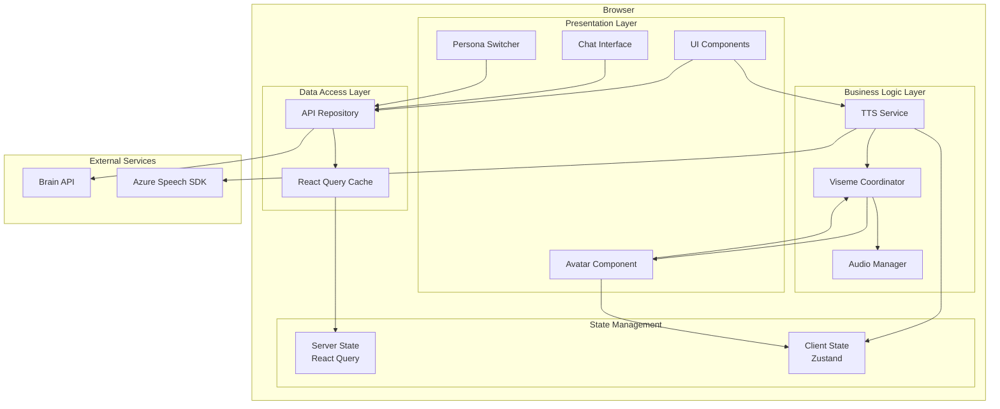

# Design Document: Avatar Client

## Overview

The Avatar Client is a Next.js 14+ web application that provides a 3D animated avatar interface for conversational AI interactions. The application follows a clean architecture approach with clear separation of concerns between presentation, business logic, and data access layers.

### Core Responsibilities

- **3D Rendering**: Display and animate a 3D avatar using react-three-fiber and Three.js
- **Speech Synthesis**: Convert text to speech using Azure Neural TTS with multi-language support
- **Lip Synchronization**: Synchronize avatar mouth movements with speech using Azure viseme data
- **Conversation Management**: Handle user input and display conversation history
- **Agent Selection**: Allow users to switch between different AI personas
- **Real-time Coordination**: Synchronize audio playback with viseme animations within 50ms accuracy

### Technology Stack

- **Framework**: Next.js 14+ (App Router)
- **Language**: TypeScript (strict mode)
- **3D Rendering**: react-three-fiber, Three.js, @react-three/drei
- **State Management**: @tanstack/react-query (server state), Zustand (client state)
- **Speech Synthesis**: Azure Speech SDK (@microsoft/cognitiveservices-speech-sdk)
- **Styling**: Tailwind CSS
- **Testing**: Vitest, React Testing Library, Playwright
- **Code Quality**: ESLint, Prettier, Husky, lint-staged

### Architectural Principles

This design adheres to The Horizon Standard principles:

1. **Single Source of Truth**: API contracts define data structures
2. **Standardized Error Handling**: Centralized error handling and user notifications
3. **State Management**: React Query for server state with caching
4. **Real-time Communication**: Event-driven architecture for viseme synchronization
5. **Observability**: Structured logging throughout the application
6. **Type Safety**: Comprehensive TypeScript types with zero `any` usage
7. **Security**: Security headers, input validation, secrets management
8. **Testing**: Unit tests, integration tests, and E2E tests

## Architecture

### High-Level Architecture



### Architectural Pattern Evaluation

#### CQRS (Command Query Responsibility Segregation)

**Decision: Not Applicable for Full CQRS**

CQRS is typically applied in backend systems with complex domain logic and separate read/write models. For this client-side application:

- **Not Needed**: The application doesn't have complex domain logic or separate read/write data stores
- **Overkill**: Full CQRS would add unnecessary complexity for a presentation-focused client
- **Alternative**: We adopt CQRS-inspired patterns where beneficial:
  - Separate command operations (POST to Brain API) from query operations (GET agents)
  - Use React Query's mutation vs query distinction
  - Clear separation between write actions (user input) and read operations (fetching data)

#### Repository Pattern

**Decision: Adopted**

The Repository Pattern abstracts data access logic and provides a clean API for the rest of the application.

**Benefits**:

- Decouples business logic from API implementation details
- Makes testing easier through dependency injection
- Centralizes API error handling
- Provides a single place to add cross-cutting concerns (logging, retries, etc.)

**Implementation**:

- `BrainApiRepository`: Handles all Brain API communication
- `AzureSpeechRepository`: Wraps Azure Speech SDK interactions

#### Service Layer Pattern

**Decision: Adopted**

Services encapsulate business logic and coordinate between repositories and UI components.

**Services**:

- `TTSService`: Orchestrates text-to-speech synthesis and viseme event handling
- `VisemeCoordinator`: Synchronizes audio playback with viseme animations
- `AudioManager`: Manages audio playback state and timing
- `NotificationService`: Centralized error and status notifications

#### State Management Strategy

**Decision: Hybrid Approach**

- **Server State (React Query)**: API data, caching, background refetching
  - Agent list
  - Chat responses
  - Configuration data
- **Client State (Zustand)**: UI state, real-time coordination
  - Current viseme data
  - Audio playback state
  - Animation state
  - Selected agent
  - Conversation history (session-scoped)

**Rationale**: React Query excels at server state management with built-in caching and refetching. Zustand provides lightweight, performant client state management without Redux boilerplate.

#### Event-Driven Architecture

**Decision: Adopted for Real-Time Synchronization**

The viseme synchronization requires precise timing coordination between multiple subsystems.

**Event Flow**:

1. User submits message → Command dispatched
2. Brain API responds → Text received
3. TTS Service synthesizes → Audio + Viseme events emitted
4. Viseme Coordinator subscribes → Schedules animations
5. Avatar Component reacts → Renders blendshapes
6. Audio Manager plays → Synchronizes timing

**Implementation**: Custom event emitter for viseme events, React state updates for UI reactivity

#### Observer Pattern

**Decision: Adopted for Audio-Viseme Coordination**

Multiple components need to react to audio playback events and viseme data.

**Observers**:

- Avatar Component observes viseme events
- Transcript Display observes audio progress
- Audio Manager observes playback state

#### Strategy Pattern

**Decision: Adopted for Voice Selection**

Different languages require different voice selection strategies.

**Strategies**:

- `LanguageVoiceStrategy`: Maps language codes to Azure voice identifiers
- `DefaultVoiceStrategy`: Fallback to English voice
- Extensible for future voice customization (gender, accent, etc.)

### Layer Responsibilities

#### Presentation Layer

**Responsibilities**:

- Render UI components
- Handle user interactions
- Display data from state
- Trigger commands/queries

**Components**:

- `AvatarCanvas`: 3D viewport container
- `AvatarModel`: Three.js mesh with blendshape animations
- `ChatInterface`: Message input and conversation history
- `PersonaSwitcher`: Agent selection dropdown
- `TranscriptDisplay`: Real-time conversation text
- `NotificationToast`: Error and status messages

**Rules**:

- Components are presentational and delegate logic to services
- No direct API calls (use repositories through hooks)
- No business logic (use services)
- Type-safe props with TypeScript interfaces

#### Business Logic Layer

**Responsibilities**:

- Implement domain logic
- Coordinate between repositories and UI
- Handle complex workflows
- Manage real-time synchronization

**Services**:

- `TTSService`: Text-to-speech orchestration
- `VisemeCoordinator`: Animation timing and synchronization
- `AudioManager`: Audio playback control
- `NotificationService`: User feedback management
- `LanguageVoiceMapper`: Voice selection logic

**Rules**:

- Services are stateless (state managed by Zustand/React Query)
- Services use dependency injection for repositories
- Services emit events for cross-cutting concerns
- All errors are caught and handled gracefully

#### Data Access Layer

**Responsibilities**:

- Abstract external API communication
- Handle HTTP requests/responses
- Manage API errors
- Provide type-safe interfaces

**Repositories**:

- `BrainApiRepository`: Brain API communication
  - `sendMessage(agentId, message)`: POST /api/chat
  - `getAgents()`: GET /api/agents
- `AzureSpeechRepository`: Azure Speech SDK wrapper
  - `synthesizeSpeech(text, voice, language)`: TTS synthesis
  - `subscribeToVisemes(callback)`: Viseme event subscription

**Rules**:

- Repositories return typed results (Result<T, Error> pattern)
- All API errors are caught and transformed to domain errors
- Repositories are injected into services
- No business logic in repositories

## Components and Interfaces

### Core Components

#### AvatarCanvas Component

```typescript
interface AvatarCanvasProps {
  modelUrl: string;
  visemeData: VisemeData | null;
  className?: string;
}

interface VisemeData {
  visemeId: number;
  timestamp: number;
  duration: number;
}
```

**Responsibilities**:

- Initialize Three.js scene with react-three-fiber
- Load GLB model with blendshapes
- Apply viseme blendshape animations
- Handle camera controls (orbit, zoom)
- Display loading and error states

**Key Features**:

- Smooth blendshape interpolation using lerp
- 60 FPS animation loop
- Automatic camera positioning
- Responsive canvas sizing

#### ChatInterface Component

```typescript
interface ChatInterfaceProps {
  onSendMessage: (message: string) => Promise<void>;
  messages: ChatMessage[];
  isLoading: boolean;
}

interface ChatMessage {
  id: string;
  role: 'user' | 'agent';
  content: string;
  timestamp: Date;
}
```

**Responsibilities**:

- Display conversation history
- Accept user input
- Submit messages to Brain API
- Show loading states
- Handle errors

**Key Features**:

- Auto-scroll to latest message
- Keyboard shortcuts (Enter to send)
- Optimistic UI updates
- Message timestamps

#### PersonaSwitcher Component

```typescript
interface PersonaSwitcherProps {
  onAgentChange: (agentId: string) => void;
  selectedAgentId: string | null;
}

interface Agent {
  id: string;
  name: string;
  description?: string;
  voice: string;
  language: string;
}
```

**Responsibilities**:

- Fetch and display available agents
- Handle agent selection
- Show loading and error states
- Persist selected agent

**Key Features**:

- Dropdown UI with search
- Agent descriptions on hover
- Retry on fetch failure
- Cached agent list (5 minutes)

### Service Interfaces

#### TTSService

```typescript
interface ITTSService {
  synthesizeSpeech(
    text: string,
    voice: string,
    language: string
  ): Promise<Result<AudioBuffer, TTSError>>;

  subscribeToVisemes(callback: (viseme: VisemeEvent) => void): () => void;

  stop(): void;
}

interface VisemeEvent {
  visemeId: number;
  audioOffset: number;
  duration: number;
}

type TTSError =
  | { type: 'NETWORK_ERROR'; message: string }
  | { type: 'INVALID_VOICE'; voice: string }
  | { type: 'SYNTHESIS_FAILED'; details: string };
```

**Implementation Details**:

- Uses Azure Speech SDK SpeechSynthesizer
- Subscribes to VisemeReceived events
- Emits viseme events to coordinator
- Handles SDK errors and retries
- Manages audio buffer lifecycle

#### VisemeCoordinator

```typescript
interface IVisemeCoordinator {
  start(audioBuffer: AudioBuffer, visemes: VisemeEvent[]): void;
  stop(): void;
  getCurrentViseme(): VisemeData | null;
  subscribeToVisemeChanges(callback: (viseme: VisemeData) => void): () => void;
}
```

**Implementation Details**:

- Schedules viseme animations based on audio timing
- Uses requestAnimationFrame for smooth updates
- Synchronizes with AudioContext currentTime
- Handles playback pause/resume
- Cleans up timers on stop

#### AudioManager

```typescript
interface IAudioManager {
  play(buffer: AudioBuffer): Promise<void>;
  pause(): void;
  resume(): void;
  stop(): void;
  getCurrentTime(): number;
  getDuration(): number;
  subscribeToPlaybackState(callback: (state: PlaybackState) => void): () => void;
}

type PlaybackState = 'idle' | 'playing' | 'paused' | 'stopped';
```

**Implementation Details**:

- Uses Web Audio API (AudioContext)
- Manages AudioBufferSourceNode lifecycle
- Emits playback state changes
- Handles browser autoplay policies
- Provides accurate timing information

### Repository Interfaces

#### BrainApiRepository

```typescript
interface IBrainApiRepository {
  sendMessage(agentId: string, message: string): Promise<Result<ChatResponse, ApiError>>;

  getAgents(): Promise<Result<Agent[], ApiError>>;
}

interface ChatResponse {
  message: string;
  agentId: string;
  timestamp: string;
}

type ApiError =
  | { type: 'NETWORK_ERROR'; message: string }
  | { type: 'TIMEOUT'; duration: number }
  | { type: 'SERVER_ERROR'; status: number; details: string }
  | { type: 'VALIDATION_ERROR'; fields: string[] };
```

**Implementation Details**:

- Uses fetch API with timeout wrapper
- Implements retry logic with exponential backoff
- Transforms HTTP errors to domain errors
- Adds authentication headers if needed
- Logs all requests and responses

#### AzureSpeechRepository

```typescript
interface IAzureSpeechRepository {
  synthesize(text: string, config: SpeechConfig): Promise<Result<SynthesisResult, SpeechError>>;
}

interface SpeechConfig {
  voice: string;
  language: string;
  outputFormat: AudioFormat;
}

interface SynthesisResult {
  audioBuffer: AudioBuffer;
  visemes: VisemeEvent[];
}

type SpeechError =
  | { type: 'INVALID_KEY'; message: string }
  | { type: 'INVALID_REGION'; region: string }
  | { type: 'SYNTHESIS_FAILED'; reason: string }
  | { type: 'NETWORK_ERROR'; message: string };
```

**Implementation Details**:

- Wraps Azure Speech SDK
- Manages SDK lifecycle (create/dispose)
- Collects viseme events during synthesis
- Converts audio to Web Audio API format
- Handles SDK-specific errors

### State Management

#### Server State (React Query)

```typescript
// Agent list query
const useAgents = () => {
  return useQuery({
    queryKey: ['agents'],
    queryFn: () => brainApiRepository.getAgents(),
    staleTime: 5 * 60 * 1000, // 5 minutes
    retry: 3,
  });
};

// Chat mutation
const useSendMessage = () => {
  return useMutation({
    mutationFn: ({ agentId, message }: SendMessageParams) =>
      brainApiRepository.sendMessage(agentId, message),
    onSuccess: (response) => {
      // Trigger TTS
      ttsService.synthesizeSpeech(response.message, selectedAgent.voice, selectedAgent.language);
    },
  });
};
```

#### Client State (Zustand)

```typescript
interface AppState {
  // Agent selection
  selectedAgentId: string | null;
  setSelectedAgent: (agentId: string) => void;

  // Conversation
  messages: ChatMessage[];
  addMessage: (message: ChatMessage) => void;
  clearMessages: () => void;

  // Audio/Viseme state
  currentViseme: VisemeData | null;
  setCurrentViseme: (viseme: VisemeData | null) => void;

  playbackState: PlaybackState;
  setPlaybackState: (state: PlaybackState) => void;

  // Notifications
  notifications: Notification[];
  addNotification: (notification: Notification) => void;
  removeNotification: (id: string) => void;
}

const useAppStore = create<AppState>((set) => ({
  selectedAgentId: null,
  setSelectedAgent: (agentId) => set({ selectedAgentId: agentId }),

  messages: [],
  addMessage: (message) =>
    set((state) => ({
      messages: [...state.messages, message],
    })),
  clearMessages: () => set({ messages: [] }),

  currentViseme: null,
  setCurrentViseme: (viseme) => set({ currentViseme: viseme }),

  playbackState: 'idle',
  setPlaybackState: (state) => set({ playbackState: state }),

  notifications: [],
  addNotification: (notification) =>
    set((state) => ({
      notifications: [...state.notifications, notification],
    })),
  removeNotification: (id) =>
    set((state) => ({
      notifications: state.notifications.filter((n) => n.id !== id),
    })),
}));
```

## Data Models

### Domain Models

```typescript
// Agent configuration
interface Agent {
  id: string;
  name: string;
  description?: string;
  voice: string;
  language: string;
}

// Chat message
interface ChatMessage {
  id: string;
  role: 'user' | 'agent';
  content: string;
  timestamp: Date;
}

// Viseme data
interface VisemeData {
  visemeId: number;
  timestamp: number;
  duration: number;
}

// Viseme event from Azure
interface VisemeEvent {
  visemeId: number;
  audioOffset: number;
  duration: number;
}

// Blendshape mapping
interface BlendshapeMapping {
  visemeId: number;
  blendshapeName: string;
  targetValue: number;
}

// Notification
interface Notification {
  id: string;
  type: 'info' | 'success' | 'warning' | 'error';
  message: string;
  timestamp: Date;
  duration?: number;
}
```

### API Models

```typescript
// Brain API request
interface SendMessageRequest {
  agentId: string;
  message: string;
}

// Brain API response
interface ChatResponse {
  message: string;
  agentId: string;
  timestamp: string;
}

// Agent list response
interface AgentsResponse {
  agents: Agent[];
}
```

### Azure Speech Models

```typescript
// Speech synthesis config
interface SpeechConfig {
  voice: string;
  language: string;
  outputFormat: AudioFormat;
}

// Synthesis result
interface SynthesisResult {
  audioBuffer: AudioBuffer;
  visemes: VisemeEvent[];
}

// Audio format
type AudioFormat =
  | 'audio-16khz-32kbitrate-mono-mp3'
  | 'audio-24khz-48kbitrate-mono-mp3'
  | 'raw-16khz-16bit-mono-pcm';
```

### Error Models

```typescript
// Result type for error handling
type Result<T, E> = { success: true; data: T } | { success: false; error: E };

// Domain errors
type DomainError = ApiError | TTSError | SpeechError | ValidationError;

interface ValidationError {
  type: 'VALIDATION_ERROR';
  fields: Array<{
    field: string;
    message: string;
  }>;
}
```

### Viseme-to-Blendshape Mapping

Azure Speech SDK provides 22 viseme IDs (0-21). These must be mapped to blendshape targets in the GLB model.

```typescript
const VISEME_BLENDSHAPE_MAP: Record<number, string> = {
  0: 'viseme_sil', // Silence
  1: 'viseme_PP', // p, b, m
  2: 'viseme_FF', // f, v
  3: 'viseme_TH', // th
  4: 'viseme_DD', // t, d
  5: 'viseme_kk', // k, g
  6: 'viseme_CH', // ch, j, sh
  7: 'viseme_SS', // s, z
  8: 'viseme_nn', // n, l
  9: 'viseme_RR', // r
  10: 'viseme_aa', // a (father)
  11: 'viseme_E', // e (bed)
  12: 'viseme_I', // i (feet)
  13: 'viseme_O', // o (boat)
  14: 'viseme_U', // u (book)
  15: 'viseme_aa', // a (cat)
  16: 'viseme_E', // e (pet)
  17: 'viseme_I', // i (sit)
  18: 'viseme_O', // o (dog)
  19: 'viseme_U', // u (put)
  20: 'viseme_aa', // a (about)
  21: 'viseme_E', // e (taken)
};
```

**Note**: The GLB model must contain blendshape targets matching these names. If the model uses different naming conventions, this mapping must be adjusted accordingly.

## Correctness Properties

_A property is a characteristic or behavior that should hold true across all valid executions of a system—essentially, a formal statement about what the system should do. Properties serve as the bridge between human-readable specifications and machine-verifiable correctness guarantees._

### Property Reflection

After analyzing all acceptance criteria, I identified the following redundancies and consolidations:

**Redundant Properties Eliminated**:

- Requirements 6.1 and 6.2 are covered by 4.1 and 5.3 (API endpoint calls)
- Requirement 7.1 is identical to 2.5 (language-based voice selection)
- Requirement 10.4 is identical to 1.5 (GLB model load error handling)
- Requirement 19.3 is identical to 10.5 (error logging)
- Requirements 20.4 and 20.5 are identical to 16.5 and 16.6 (Husky and lint-staged)

**Properties Combined**:

- Message display properties (5.5, 9.1, 9.3) combined into comprehensive message rendering property
- Security header properties (14.1-14.4) combined into single security headers property
- Documentation properties (18.1-18.7) combined into README completeness property
- TypeScript configuration properties (15.4-15.6) combined into TypeScript compliance property

**Edge Cases Handled by Generators**:

- Requirement 7.4 (unsupported language fallback) will be covered by property test generators

### Core Functional Properties

#### Property 1: GLB Model Loading

_For any_ valid GLB model file path, the Avatar Component should successfully load the model and extract blendshape data, or handle load failures gracefully with error messages and logging.

**Validates: Requirements 1.1, 1.5**

#### Property 2: Text-to-Speech Synthesis

_For any_ non-empty text string and valid voice configuration, the TTS Service should produce an audio buffer and emit corresponding viseme events.

**Validates: Requirements 2.2, 2.3**

#### Property 3: Voice Selection by Configuration

_For any_ agent configuration with a specified voice identifier, the TTS Service should use that exact voice for speech synthesis.

**Validates: Requirements 2.4**

#### Property 4: Language-Based Voice Selection

_For any_ supported language code (en-US, es-ES, fr-FR, de-DE, ja-JP, zh-CN), the TTS Service should select an appropriate Azure Neural TTS voice matching that language.

**Validates: Requirements 2.5, 7.5**

#### Property 5: Viseme Event Forwarding

_For any_ viseme event received from Azure Speech SDK, the TTS Service should forward the viseme ID and timing data to the Avatar Component without loss or corruption.

**Validates: Requirements 3.2**

#### Property 6: Viseme-to-Blendshape Mapping

_For any_ valid Azure viseme ID (0-21), the Avatar Component should map it to a corresponding blendshape target name in the GLB model.

**Validates: Requirements 3.3**

#### Property 7: Blendshape Interpolation

_For any_ sequence of viseme events with timing data, the Avatar Component should interpolate blendshape values smoothly over time, creating continuous mouth animations.

**Validates: Requirements 3.4**

#### Property 8: Audio-Viseme Synchronization Timing

_For any_ audio playback with viseme data, the timing difference between audio playback position and viseme animation should not exceed 50 milliseconds.

**Validates: Requirements 3.5**

#### Property 9: Agent Selection State Management

_For any_ agent selected from the dropdown, the application state should update to reflect that agent as the active conversation context, and all subsequent operations should use that agent.

**Validates: Requirements 4.3**

#### Property 10: Agent ID in Chat Requests

_For any_ chat message sent after an agent is selected, the HTTP request payload should include the selected agent's identifier.

**Validates: Requirements 4.4, 5.4**

#### Property 11: Agent Display Information

_For any_ agent in the dropdown, both the agent name and description (if present) should be displayed to the user.

**Validates: Requirements 4.6**

#### Property 12: Chat Message Submission

_For any_ user message submitted through the chat interface, an HTTP POST request should be sent to the Brain API `/api/chat` endpoint with the message text and agent ID.

**Validates: Requirements 5.3, 5.4**

#### Property 13: Response Display and TTS Trigger

_For any_ response received from the Brain API, the response text should be displayed in the conversation history and passed to the TTS Service for speech synthesis.

**Validates: Requirements 5.5, 5.6**

#### Property 14: Input Disabling During Request

_For any_ pending Brain API request, the chat input field should be disabled until the request completes (success or failure).

**Validates: Requirements 5.7**

#### Property 15: HTTP Headers in API Requests

_For any_ HTTP request to the Brain API, the request should include proper headers including `Content-Type: application/json`.

**Validates: Requirements 6.4**

#### Property 16: JSON Response Parsing

_For any_ valid JSON response from the Brain API, the application should successfully parse the response into typed data structures.

**Validates: Requirements 6.5**

#### Property 17: Request Timeout Handling

_For any_ Brain API request that exceeds 30 seconds, the request should timeout and trigger error handling.

**Validates: Requirements 6.7**

#### Property 18: Environment Variable Validation

_For any_ required environment variable (AZURE_SPEECH_KEY, AZURE_SPEECH_REGION, BRAIN_API_URL), if the variable is missing at startup, the application should log an error specifying the missing variable and prevent startup.

**Validates: Requirements 8.7, 8.8**

#### Property 19: Message Chronological Ordering

_For any_ sequence of messages in the conversation history, the messages should be displayed in chronological order based on their timestamps.

**Validates: Requirements 9.3**

#### Property 20: Auto-Scroll to Latest Message

_For any_ new message added to the conversation history, the transcript display should automatically scroll to show the most recent message.

**Validates: Requirements 9.4**

#### Property 21: Visual Message Distinction

_For any_ message in the conversation history, user messages and agent responses should have visually distinct styling to differentiate them.

**Validates: Requirements 9.5**

#### Property 22: Network Error Notifications

_For any_ network request failure, the application should display a user-friendly error notification with the failure reason.

**Validates: Requirements 10.2**

#### Property 23: Structured Error Logging

_For any_ error that occurs in the application, a structured log entry should be created with timestamp, error type, and contextual information.

**Validates: Requirements 10.5**

#### Property 24: Error Boundary Protection

_For any_ component that throws an error during rendering, the error boundary should catch the error and prevent the entire application from crashing.

**Validates: Requirements 10.6**

#### Property 25: Agent List Caching

_For any_ agent list fetch from `/api/agents`, subsequent fetches within 5 minutes should use the cached data without making a new network request.

**Validates: Requirements 11.2**

#### Property 26: Optimistic UI Updates

_For any_ user message submission, the message should appear in the conversation history immediately before the API response is received.

**Validates: Requirements 11.3**

#### Property 27: Session Conversation Persistence

_For any_ message added to the conversation history, the message should persist in client-side state for the duration of the session.

**Validates: Requirements 11.4**

#### Property 28: Loading State Display

_For any_ asynchronous operation (API call, model loading, TTS synthesis), a loading state indicator should be displayed to the user.

**Validates: Requirements 11.6**

#### Property 29: Avatar Aspect Ratio Maintenance

_For any_ viewport size change, the Avatar Component should maintain its aspect ratio and scale appropriately without distortion.

**Validates: Requirements 12.4**

#### Property 30: ARIA Labels for Interactive Components

_For any_ interactive UI component (buttons, inputs, dropdowns), proper ARIA labels should be present for accessibility.

**Validates: Requirements 13.1**

#### Property 31: Text Alternatives for Audio

_For any_ audio content played through TTS, corresponding text should be displayed in the Transcript Display as a text alternative.

**Validates: Requirements 13.4**

#### Property 32: Screen Reader Announcements

_For any_ new message or status change, the application should trigger screen reader announcements to notify users of assistive technologies.

**Validates: Requirements 13.6**

#### Property 33: Input Validation and Sanitization

_For any_ user input before sending to the Brain API, the input should be validated and sanitized to prevent injection attacks.

**Validates: Requirements 14.5**

#### Property 34: Sensitive Data Protection in Logs

_For any_ log entry created by the application, the log should not contain sensitive data including API keys, tokens, or personal information.

**Validates: Requirements 14.6**

#### Property 35: TypeScript Type Coverage

_For any_ API request/response payload and component props/state, explicit TypeScript interfaces or types should be defined.

**Validates: Requirements 15.2, 15.3**

#### Property 36: Structured API Request Logging

_For any_ API request made to the Brain API, a structured log entry should be created including endpoint, method, and response status.

**Validates: Requirements 19.2**

#### Property 37: ISO 8601 Timestamp Format

_For any_ log entry created by the application, the timestamp should be in ISO 8601 format.

**Validates: Requirements 19.5**

### Example-Based Properties

These properties test specific scenarios or configurations:

#### Example 1: Avatar Component Rendering

The Avatar Component should mount and render without errors when provided with a valid GLB model URL.

**Validates: Requirements 1.2, 1.3**

#### Example 2: TTS Synthesis Error Handling

When Azure Speech SDK synthesis fails, the TTS Service should log the error and display a user-facing error notification.

**Validates: Requirements 2.6**

#### Example 3: Environment Configuration Loading

The TTS Service should retrieve the Azure Speech API key from the `AZURE_SPEECH_KEY` environment variable.

**Validates: Requirements 2.7**

#### Example 4: Neutral Mouth Position

When no viseme event data is available, the Avatar Component should return the mouth to a neutral resting position (viseme ID 0).

**Validates: Requirements 3.7**

#### Example 5: Agent List API Call

The Persona Switcher should fetch the list of available agents from the Brain API endpoint `/api/agents` using HTTP GET.

**Validates: Requirements 4.1**

#### Example 6: Agent Dropdown Rendering

The Persona Switcher should display agent options in a dropdown UI component.

**Validates: Requirements 4.2**

#### Example 7: Agent Fetch Retry Logic

When the `/api/agents` request fails, the Persona Switcher should display an error message and retry after 5 seconds.

**Validates: Requirements 4.5**

#### Example 8: Chat Input Field Existence

The Chat Interface should provide a text input field for user message entry.

**Validates: Requirements 5.1**

#### Example 9: Conversation History Display

The Chat Interface should display a scrollable conversation history showing user messages and agent responses.

**Validates: Requirements 5.2**

#### Example 10: Chat API Error Handling

When the Brain API request fails, the Chat Interface should display an error notification and re-enable the input field.

**Validates: Requirements 5.8**

#### Example 11: Brain API URL Configuration

The Avatar Client should read the Brain API base URL from the `BRAIN_API_URL` environment variable.

**Validates: Requirements 6.3**

#### Example 12: HTTP Error Response Handling

When the Brain API returns an HTTP error status, the Avatar Client should extract error details from the response body and display them to the user.

**Validates: Requirements 6.6**

#### Example 13: Language Voice Mapping

The TTS Service should maintain a mapping of language codes to Azure Neural TTS voice identifiers for at least: en-US, es-ES, fr-FR, de-DE, ja-JP, and zh-CN.

**Validates: Requirements 7.2, 7.5**

#### Example 14: Default Voice Fallback

When no language field is provided in the Brain API response, the TTS Service should use a default English voice.

**Validates: Requirements 7.3**

#### Example 15: Environment File Documentation

The Avatar Client repository should include a `.env.example` file in the root directory listing all required environment variables with descriptive comments.

**Validates: Requirements 8.1, 8.2, 8.3, 8.4, 8.5, 8.6**

#### Example 16: Centralized Notification System

The Avatar Client should implement a centralized notification system for displaying errors and status messages.

**Validates: Requirements 10.1**

#### Example 17: TTS Error Notification with Retry

When the Azure Speech SDK fails to synthesize speech, the Avatar Client should display an error notification and allow the user to retry.

**Validates: Requirements 10.3**

#### Example 18: GLB Model Preloading

The Avatar Client should preload the GLB model during application initialization to minimize first-render delay.

**Validates: Requirements 11.5**

#### Example 19: Desktop Layout Organization

On desktop screens (≥1024px width), the Avatar Client should display the 3D viewport, chat interface, and persona switcher in an organized layout.

**Validates: Requirements 12.2**

#### Example 20: Mobile Vertical Stacking

When the viewport width is less than 1024 pixels, the Avatar Client should stack UI components vertically for mobile viewing.

**Validates: Requirements 12.3**

#### Example 21: Mobile Touch Support

The Chat Interface should remain accessible and usable on mobile devices with touch input.

**Validates: Requirements 12.5**

#### Example 22: Keyboard Navigation for Chat

The Chat Interface should support keyboard navigation for message input and submission (Enter key to send).

**Validates: Requirements 13.2**

#### Example 23: Keyboard Navigation for Persona Switcher

The Persona Switcher should be operable via keyboard without requiring mouse interaction.

**Validates: Requirements 13.3**

#### Example 24: Color Contrast Compliance

The Avatar Client should maintain sufficient color contrast ratios (WCAG AA standard minimum 4.5:1 for normal text).

**Validates: Requirements 13.5**

#### Example 25: Security Headers Configuration

The Avatar Client should implement security headers: Content-Security-Policy, X-Frame-Options: DENY, X-Content-Type-Options: nosniff, and Strict-Transport-Security.

**Validates: Requirements 14.1, 14.2, 14.3, 14.4**

#### Example 26: No Hardcoded Secrets

The Avatar Client should store API keys and secrets in environment variables, never in source code.

**Validates: Requirements 14.7**

#### Example 27: TypeScript File Usage

The Avatar Client should use TypeScript for all source code files (.ts/.tsx extensions).

**Validates: Requirements 15.1**

#### Example 28: TypeScript Strict Mode Compliance

The Avatar Client should achieve zero `any` types in the codebase (except auto-generated files), enable strict TypeScript compiler options, and pass TypeScript compilation with zero errors.

**Validates: Requirements 15.4, 15.5, 15.6**

#### Example 29: Test Infrastructure

The Avatar Client should include unit tests (Vitest), component tests (React Testing Library), integration tests for API communication, and achieve minimum 80% code coverage for business logic.

**Validates: Requirements 16.1, 16.2, 16.3, 16.4**

#### Example 30: Pre-Commit Hooks

The Avatar Client should implement pre-commit hooks using Husky to run tests on changed files, and configure lint-staged to run linting and formatting on staged files before commit.

**Validates: Requirements 16.5, 16.6**

#### Example 31: NPM Scripts

The Avatar Client should provide npm scripts for common development tasks: dev, build, test, lint.

**Validates: Requirements 17.1**

#### Example 32: Linting and Formatting

The Avatar Client should use ESLint for code linting with zero errors, and Prettier for code formatting with consistent configuration.

**Validates: Requirements 17.2, 17.3**

#### Example 33: Production Build Success

The Avatar Client should successfully build for production using `npm run build` with zero errors and generate optimized bundles with code splitting and tree shaking.

**Validates: Requirements 17.4, 17.6**

#### Example 34: README Completeness

The Avatar Client should include a comprehensive README.md file with: project overview, installation instructions, environment variable documentation, development instructions, deployment instructions, technology stack documentation, and troubleshooting guidance.

**Validates: Requirements 18.1, 18.2, 18.3, 18.4, 18.5, 18.6, 18.7**

#### Example 35: Structured Logging Format

The Avatar Client should implement structured logging in JSON format with contextual properties.

**Validates: Requirements 19.1**

#### Example 36: Application Lifecycle Logging

The Avatar Client should log application lifecycle events including startup and configuration loading.

**Validates: Requirements 19.4**

#### Example 37: Configurable Log Levels

The Avatar Client should support configurable log levels (debug, info, warn, error) via environment configuration.

**Validates: Requirements 19.6**

#### Example 38: Commit Message Validation

The Avatar Client should implement commit message validation using commitlint or equivalent to enforce conventional commit format.

**Validates: Requirements 20.2**

#### Example 39: Git Workflow Documentation

The Avatar Client should document the git workflow and branching strategy in the README.md.

**Validates: Requirements 20.3**

## Error Handling

### Error Handling Strategy

The application implements a layered error handling approach with centralized error management and user-friendly notifications.

### Error Categories

#### 1. Network Errors

**Sources**:

- Brain API communication failures
- Azure Speech SDK network issues
- Timeout errors

**Handling**:

- Catch at repository layer
- Transform to domain errors with context
- Display user-friendly notifications
- Implement retry logic with exponential backoff
- Log structured error details

**User Experience**:

- Show notification: "Unable to connect to server. Retrying..."
- Provide manual retry button
- Maintain application state for recovery

#### 2. Validation Errors

**Sources**:

- Invalid user input
- Missing required fields
- Malformed data

**Handling**:

- Validate at input boundaries
- Sanitize before API calls
- Return specific field-level errors
- Prevent submission of invalid data

**User Experience**:

- Show inline validation messages
- Highlight invalid fields
- Provide clear guidance on corrections

#### 3. Resource Loading Errors

**Sources**:

- GLB model loading failures
- Audio buffer creation errors
- Asset loading failures

**Handling**:

- Catch during resource initialization
- Display error with troubleshooting guidance
- Provide fallback UI or retry option
- Log detailed error information

**User Experience**:

- Show error message: "Failed to load 3D model. Please check the model file."
- Offer retry button
- Gracefully degrade to text-only mode if needed

#### 4. Speech Synthesis Errors

**Sources**:

- Invalid Azure credentials
- Unsupported voice/language
- Synthesis failures

**Handling**:

- Catch at TTS Service layer
- Check credentials at startup
- Fallback to default voice for unsupported languages
- Log warnings for configuration issues

**User Experience**:

- Show notification: "Speech synthesis failed. Please check your configuration."
- Display text response even if audio fails
- Provide retry option

#### 5. Runtime Errors

**Sources**:

- Component rendering errors
- Unexpected exceptions
- State management errors

**Handling**:

- Implement React Error Boundaries
- Catch and log errors with stack traces
- Prevent full application crash
- Maintain unaffected features

**User Experience**:

- Show error boundary fallback UI
- Provide "Reload" button
- Log error for debugging

### Error Transformation

Errors are transformed at each layer to provide appropriate context:

```typescript
// Repository Layer: HTTP Error → Domain Error
try {
  const response = await fetch(url);
  if (!response.ok) {
    return {
      success: false,
      error: {
        type: 'SERVER_ERROR',
        status: response.status,
        details: await response.text(),
      },
    };
  }
} catch (error) {
  return {
    success: false,
    error: {
      type: 'NETWORK_ERROR',
      message: error.message,
    },
  };
}

// Service Layer: Domain Error → User Notification
const result = await repository.sendMessage(agentId, message);
if (!result.success) {
  notificationService.error(getUserFriendlyMessage(result.error));
  logger.error('Chat request failed', {
    error: result.error,
    agentId,
    timestamp: new Date().toISOString(),
  });
}
```

### Notification System

**Implementation**: Zustand store + Toast component

**Features**:

- Auto-dismiss after configurable duration
- Manual dismiss option
- Queue management for multiple notifications
- Type-based styling (info, success, warning, error)
- Accessibility support (ARIA live regions)

**Notification Types**:

- **Info**: General information (e.g., "Agent switched to GPT-4")
- **Success**: Successful operations (e.g., "Message sent")
- **Warning**: Non-critical issues (e.g., "Using default voice")
- **Error**: Failures requiring attention (e.g., "Failed to connect")

### Logging Strategy

**Format**: Structured JSON logs

**Log Levels**:

- **Debug**: Detailed diagnostic information
- **Info**: General informational messages
- **Warn**: Warning messages for potential issues
- **Error**: Error messages with stack traces

**Log Context**:

- Timestamp (ISO 8601)
- Log level
- Component/service name
- Error type and message
- Stack trace (for errors)
- User action context
- Request/response data (sanitized)

**Example Log Entry**:

```json
{
  "timestamp": "2024-01-15T10:30:45.123Z",
  "level": "error",
  "component": "TTSService",
  "errorType": "SYNTHESIS_FAILED",
  "message": "Azure Speech SDK synthesis failed",
  "context": {
    "voice": "en-US-JennyNeural",
    "language": "en-US",
    "textLength": 150
  },
  "stack": "Error: Synthesis failed\n  at TTSService.synthesize..."
}
```

### Error Recovery Strategies

#### Automatic Recovery

- **Network errors**: Retry with exponential backoff (3 attempts)
- **Transient failures**: Automatic retry after delay
- **Cache fallback**: Use cached data when API unavailable

#### Manual Recovery

- **Retry buttons**: Allow user to manually retry failed operations
- **Refresh actions**: Reload specific components or data
- **Reset options**: Clear state and start fresh

#### Graceful Degradation

- **Audio failure**: Continue with text-only mode
- **Model loading failure**: Show placeholder or 2D avatar
- **API unavailable**: Show cached data with staleness indicator

### Error Boundaries

**Implementation**: React Error Boundaries at strategic points

**Boundary Locations**:

- Root application boundary (catches all errors)
- Avatar Component boundary (isolates 3D rendering errors)
- Chat Interface boundary (isolates conversation errors)
- Persona Switcher boundary (isolates agent selection errors)

**Fallback UI**:

- Error message with description
- "Reload Component" button
- "Report Issue" link (optional)
- Maintains rest of application functionality

## Testing Strategy

### Testing Philosophy

The Avatar Client follows a comprehensive testing approach combining unit tests, integration tests, property-based tests, and end-to-end tests. The goal is to achieve high confidence in correctness while maintaining fast feedback loops.

### Dual Testing Approach

**Unit Tests**: Verify specific examples, edge cases, and error conditions

- Focus on specific scenarios and concrete examples
- Test individual functions and components in isolation
- Fast execution for rapid feedback
- Cover edge cases and error paths

**Property-Based Tests**: Verify universal properties across all inputs

- Test properties that should hold for any valid input
- Use randomized input generation for comprehensive coverage
- Minimum 100 iterations per property test
- Catch unexpected edge cases through randomization

**Together**: Unit tests catch concrete bugs, property tests verify general correctness

### Testing Stack

- **Test Runner**: Vitest (fast, ESM-native, Vite-compatible)
- **Component Testing**: React Testing Library (user-centric testing)
- **Property Testing**: fast-check (property-based testing for JavaScript/TypeScript)
- **E2E Testing**: Playwright (cross-browser end-to-end tests)
- **Mocking**: Vitest mocks, MSW (Mock Service Worker) for API mocking
- **Coverage**: Vitest coverage (minimum 80% for business logic)

### Test Organization

```
src/
├── components/
│   ├── AvatarCanvas/
│   │   ├── AvatarCanvas.tsx
│   │   ├── AvatarCanvas.test.tsx          # Unit tests
│   │   └── AvatarCanvas.properties.test.tsx # Property tests
│   ├── ChatInterface/
│   │   ├── ChatInterface.tsx
│   │   ├── ChatInterface.test.tsx
│   │   └── ChatInterface.properties.test.tsx
├── services/
│   ├── TTSService/
│   │   ├── TTSService.ts
│   │   ├── TTSService.test.ts
│   │   └── TTSService.properties.test.ts
├── repositories/
│   ├── BrainApiRepository/
│   │   ├── BrainApiRepository.ts
│   │   ├── BrainApiRepository.test.ts
│   │   └── BrainApiRepository.integration.test.ts
└── e2e/
    ├── conversation-flow.spec.ts
    ├── agent-switching.spec.ts
    └── error-handling.spec.ts
```

### Unit Testing Strategy

**What to Test**:

- Individual component rendering
- User interaction handlers
- Service method behavior
- Repository error handling
- State management logic
- Utility functions

**Example Unit Tests**:

```typescript
// Component test
describe('ChatInterface', () => {
  it('should display user message immediately after submission', async () => {
    const { getByRole, getByText } = render(<ChatInterface />);
    const input = getByRole('textbox');
    const sendButton = getByRole('button', { name: /send/i });

    await userEvent.type(input, 'Hello');
    await userEvent.click(sendButton);

    expect(getByText('Hello')).toBeInTheDocument();
  });

  it('should disable input during API request', async () => {
    const { getByRole } = render(<ChatInterface />);
    const input = getByRole('textbox');

    await userEvent.type(input, 'Hello');
    await userEvent.click(getByRole('button', { name: /send/i }));

    expect(input).toBeDisabled();
  });
});

// Service test
describe('TTSService', () => {
  it('should log error and notify user when synthesis fails', async () => {
    const mockLogger = vi.fn();
    const mockNotify = vi.fn();
    const service = new TTSService(mockLogger, mockNotify);

    // Mock Azure SDK to throw error
    vi.spyOn(service, 'synthesize').mockRejectedValue(
      new Error('Synthesis failed')
    );

    await service.synthesizeSpeech('test', 'en-US-JennyNeural', 'en-US');

    expect(mockLogger).toHaveBeenCalledWith(
      expect.objectContaining({ level: 'error' })
    );
    expect(mockNotify).toHaveBeenCalledWith(
      expect.objectContaining({ type: 'error' })
    );
  });
});
```

### Property-Based Testing Strategy

**Configuration**: Minimum 100 iterations per property test

**Tagging**: Each property test must reference its design document property

```typescript
/**
 * Feature: avatar-client, Property 2: Text-to-Speech Synthesis
 * For any non-empty text string and valid voice configuration,
 * the TTS Service should produce an audio buffer and emit viseme events.
 */
```

**What to Test**:

- Universal properties that hold for all inputs
- Round-trip properties (serialize/deserialize)
- Invariants (properties that never change)
- Metamorphic properties (relationships between inputs/outputs)

**Example Property Tests**:

```typescript
import fc from 'fast-check';

/**
 * Feature: avatar-client, Property 6: Viseme-to-Blendshape Mapping
 * For any valid Azure viseme ID (0-21), the Avatar Component should map it
 * to a corresponding blendshape target name in the GLB model.
 */
describe('Property: Viseme-to-Blendshape Mapping', () => {
  it('should map all valid viseme IDs to blendshape names', () => {
    fc.assert(
      fc.property(
        fc.integer({ min: 0, max: 21 }), // Valid viseme IDs
        (visemeId) => {
          const blendshapeName = mapVisemeToBlendshape(visemeId);

          // Property: mapping should always return a non-empty string
          expect(blendshapeName).toBeTruthy();
          expect(typeof blendshapeName).toBe('string');
          expect(blendshapeName.length).toBeGreaterThan(0);
        }
      ),
      { numRuns: 100 }
    );
  });
});

/**
 * Feature: avatar-client, Property 8: Audio-Viseme Synchronization Timing
 * For any audio playback with viseme data, the timing difference between
 * audio playback position and viseme animation should not exceed 50ms.
 */
describe('Property: Audio-Viseme Synchronization', () => {
  it('should maintain sync within 50ms tolerance', () => {
    fc.assert(
      fc.property(
        fc.array(fc.record({
          visemeId: fc.integer({ min: 0, max: 21 }),
          audioOffset: fc.float({ min: 0, max: 10000 }),
          duration: fc.float({ min: 10, max: 500 })
        })),
        (visemeEvents) => {
          const coordinator = new VisemeCoordinator();
          const audioBuffer = createMockAudioBuffer(10); // 10 seconds

          coordinator.start(audioBuffer, visemeEvents);

          // Check sync at multiple time points
          for (let t = 0; t < 10000; t += 100) {
            const currentViseme = coordinator.getCurrentVisemeAt(t);
            const expectedViseme = findExpectedVisemeAt(visemeEvents, t);

            if (currentViseme && expectedViseme) {
              const timingDiff = Math.abs(
                currentViseme.timestamp - expectedViseme.audioOffset
              );
              expect(timingDiff).toBeLessThanOrEqual(50);
            }
          }
        }
      ),
      { numRuns: 100 }
    );
  });
});

/**
 * Feature: avatar-client, Property 19: Message Chronological Ordering
 * For any sequence of messages, they should be displayed in chronological
 * order based on their timestamps.
 */
describe('Property: Message Chronological Ordering', () => {
  it('should maintain chronological order for any message sequence', () => {
    fc.assert(
      fc.property(
        fc.array(fc.record({
          id: fc.uuid(),
          role: fc.constantFrom('user', 'agent'),
          content: fc.string({ minLength: 1, maxLength: 500 }),
          timestamp: fc.date()
        })),
        (messages) => {
          const { container } = render(
            <TranscriptDisplay messages={messages} />
          );

          const displayedMessages = container.querySelectorAll('[data-message-id]');
          const displayedTimestamps = Array.from(displayedMessages).map(
            el => new Date(el.getAttribute('data-timestamp'))
          );

          // Property: displayed messages should be sorted by timestamp
          for (let i = 1; i < displayedTimestamps.length; i++) {
            expect(displayedTimestamps[i].getTime())
              .toBeGreaterThanOrEqual(displayedTimestamps[i - 1].getTime());
          }
        }
      ),
      { numRuns: 100 }
    );
  });
});
```

### Integration Testing Strategy

**What to Test**:

- API communication with Brain API
- Azure Speech SDK integration
- State management integration
- Component interaction flows

**Mocking Strategy**:

- Use MSW (Mock Service Worker) for API mocking
- Mock Azure Speech SDK at the boundary
- Use real state management (no mocking)

**Example Integration Tests**:

```typescript
import { setupServer } from 'msw/node';
import { rest } from 'msw';

const server = setupServer(
  rest.get('/api/agents', (req, res, ctx) => {
    return res(ctx.json({
      agents: [
        { id: '1', name: 'GPT-4', voice: 'en-US-JennyNeural', language: 'en-US' }
      ]
    }));
  }),
  rest.post('/api/chat', (req, res, ctx) => {
    return res(ctx.json({
      message: 'Hello! How can I help you?',
      agentId: '1',
      timestamp: new Date().toISOString()
    }));
  })
);

beforeAll(() => server.listen());
afterEach(() => server.resetHandlers());
afterAll(() => server.close());

describe('Chat Flow Integration', () => {
  it('should complete full conversation flow', async () => {
    const { getByRole, getByText } = render(<App />);

    // Wait for agents to load
    await waitFor(() => {
      expect(getByRole('combobox')).toBeInTheDocument();
    });

    // Select agent
    await userEvent.selectOptions(getByRole('combobox'), '1');

    // Send message
    const input = getByRole('textbox');
    await userEvent.type(input, 'Hello');
    await userEvent.click(getByRole('button', { name: /send/i }));

    // Verify response appears
    await waitFor(() => {
      expect(getByText('Hello! How can I help you?')).toBeInTheDocument();
    });
  });
});
```

### End-to-End Testing Strategy

**What to Test**:

- Critical user journeys
- Cross-browser compatibility
- Real API integration (staging environment)
- Visual regression testing

**Test Scenarios**:

1. Complete conversation flow (select agent → send message → receive response → hear audio)
2. Agent switching mid-conversation
3. Error recovery (network failure → retry → success)
4. Mobile responsive behavior
5. Accessibility with screen readers

**Example E2E Tests**:

```typescript
import { test, expect } from '@playwright/test';

test('complete conversation flow', async ({ page }) => {
  await page.goto('http://localhost:3000');

  // Select agent
  await page.selectOption('[data-testid="agent-selector"]', 'gpt-4');

  // Send message
  await page.fill('[data-testid="message-input"]', 'Hello');
  await page.click('[data-testid="send-button"]');

  // Wait for response
  await expect(page.locator('[data-testid="agent-message"]').first()).toBeVisible({
    timeout: 10000,
  });

  // Verify audio is playing
  const audioPlaying = await page.evaluate(() => {
    const audioContext = window.audioContext;
    return audioContext && audioContext.state === 'running';
  });
  expect(audioPlaying).toBe(true);

  // Verify avatar is animating
  await expect(page.locator('[data-testid="avatar-canvas"]')).toHaveAttribute(
    'data-animating',
    'true'
  );
});

test('error recovery flow', async ({ page }) => {
  // Simulate network failure
  await page.route('**/api/chat', (route) => route.abort());

  await page.goto('http://localhost:3000');
  await page.fill('[data-testid="message-input"]', 'Hello');
  await page.click('[data-testid="send-button"]');

  // Verify error notification
  await expect(page.locator('[data-testid="error-notification"]')).toBeVisible();

  // Restore network and retry
  await page.unroute('**/api/chat');
  await page.click('[data-testid="retry-button"]');

  // Verify success
  await expect(page.locator('[data-testid="agent-message"]').first()).toBeVisible({
    timeout: 10000,
  });
});
```

### Test Coverage Goals

**Minimum Coverage Targets**:

- Business logic (services, repositories): 80%
- Components: 70%
- Utilities: 90%
- Overall: 75%

**Coverage Exclusions**:

- Type definitions
- Configuration files
- Auto-generated code
- Third-party library wrappers (minimal logic)

### Continuous Integration

**Pre-Commit**:

- Lint-staged runs linting and formatting
- Husky runs tests on changed files (`--findRelatedTests`)

**CI Pipeline** (GitHub Actions):

1. Install dependencies
2. Run linting (`npm run lint`)
3. Run type checking (`tsc --noEmit`)
4. Run unit tests (`npm test`)
5. Run integration tests
6. Run E2E tests (Playwright)
7. Generate coverage report
8. Upload coverage to Codecov
9. Build production bundle
10. Deploy to staging (on main branch)

### Test Maintenance

**Best Practices**:

- Keep tests focused and isolated
- Use descriptive test names
- Avoid test interdependencies
- Mock external dependencies appropriately
- Update tests when requirements change
- Remove obsolete tests
- Refactor tests alongside code

**Test Review Checklist**:

- ✅ Tests are readable and maintainable
- ✅ Tests cover happy path and error cases
- ✅ Property tests have sufficient iterations (100+)
- ✅ Tests are properly tagged with feature/property references
- ✅ Mocks are appropriate and not over-mocked
- ✅ Tests run quickly (unit tests < 1s, integration < 5s)
- ✅ Tests are deterministic (no flaky tests)

---

## Summary

This design document provides a comprehensive architecture for the Avatar Client application, incorporating:

1. **Architectural Patterns**: Repository pattern, Service layer, Event-driven architecture for real-time synchronization, and CQRS-inspired separation of commands and queries
2. **State Management**: Hybrid approach with React Query for server state and Zustand for client state
3. **Real-Time Coordination**: Event-driven viseme synchronization with 50ms accuracy requirement
4. **Error Handling**: Layered error handling with centralized notifications and graceful degradation
5. **Testing Strategy**: Comprehensive dual approach with unit tests and property-based tests (100+ iterations)
6. **Type Safety**: Full TypeScript coverage with zero `any` types
7. **Security**: Security headers, input validation, and secrets management
8. **Accessibility**: ARIA labels, keyboard navigation, and screen reader support
9. **Observability**: Structured logging with contextual information

The design adheres to The Horizon Standard principles and provides a solid foundation for building a production-grade conversational AI avatar interface.
