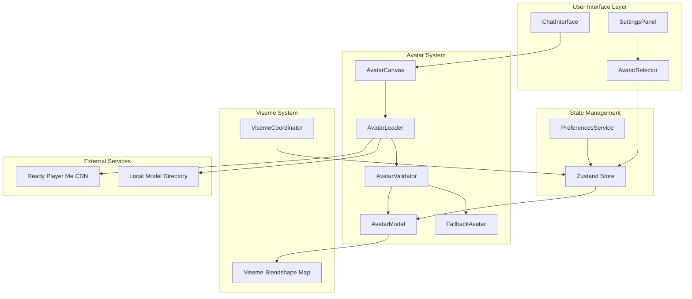
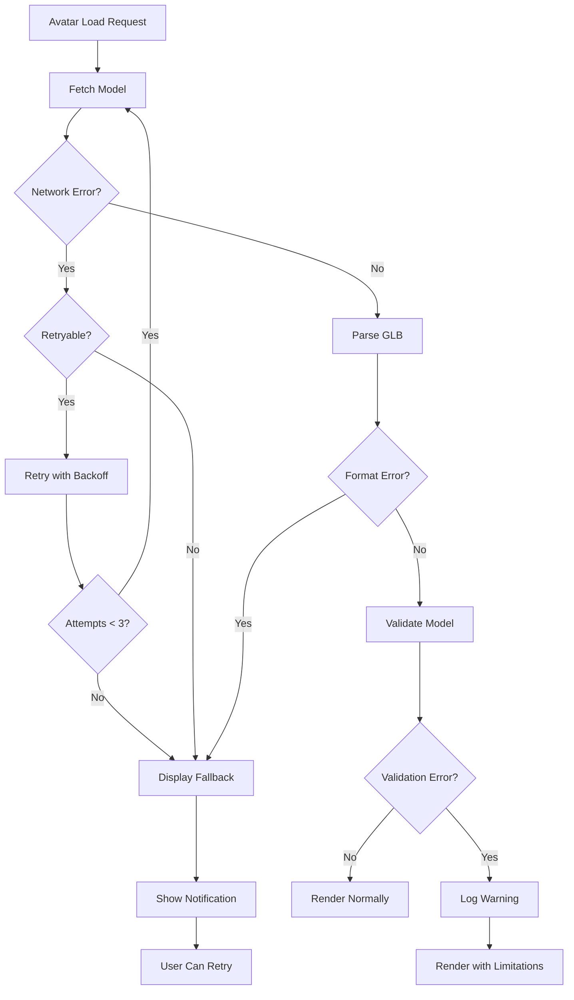

# Design Document: Ready Player Me Avatar Integration

## Overview

This design document specifies the architecture and implementation details for integrating Ready Player Me avatars into the existing 3D avatar system with robust fallback mechanisms. The system will provide multiple professional avatar options while maintaining compatibility with the existing viseme-based lip synchronization system.

### Goals

1. Integrate Ready Player Me GLB avatar models with the existing react-three-fiber rendering system
2. Provide multiple default avatar options for user personalization
3. Implement robust error handling with geometric fallback avatars
4. Maintain compatibility with the existing Azure Speech SDK viseme system
5. Ensure graceful degradation when network, WebGL, or model loading issues occur
6. Provide clear user feedback and recovery options for avatar loading failures

### Non-Goals

1. Custom avatar creation or editing tools (users select from pre-configured options)
2. Avatar animation beyond lip synchronization (no body movements, gestures, or expressions)
3. Multi-user avatar rendering (single avatar per session)
4. Avatar persistence across devices (preferences stored locally only)
5. Real-time avatar customization (color changes, accessories, etc.)

### Key Design Decisions

**Ready Player Me Integration**: Ready Player Me provides professional, pre-rigged 3D avatars in GLB format with standardized blendshape naming conventions. This eliminates the need for custom avatar modeling and rigging while ensuring compatibility with industry-standard tools.

**Geometric Fallback Strategy**: A simple geometric primitive (cube or sphere) serves as the ultimate fallback when all avatar loading attempts fail. This ensures the application remains functional even in worst-case scenarios (no network, WebGL issues, corrupted models).

**Environment-Based Configuration**: Avatar URLs are configured through environment variables, allowing easy updates without code changes and supporting different avatar sets for development and production environments.

**Caching Strategy**: Successfully loaded avatar models are cached in memory using the existing useGLTF cache mechanism, reducing network requests and improving performance when switching between previously loaded avatars.

**Retry Logic**: Transient network failures are handled with exponential backoff retry logic (3 attempts with 1s, 2s, 4s delays), while permanent failures (404, invalid format) immediately fall back to the geometric avatar.

## Architecture

### System Context

The Ready Player Me avatar system integrates with the existing application architecture:



### Component Responsibilities

**AvatarCanvas**: Main rendering component that manages the react-three-fiber Canvas, lighting, camera controls, and error boundaries. Handles WebGL context loss/restoration events.

**AvatarLoader**: Responsible for fetching avatar models from URLs (remote or local), implementing retry logic, caching, and error handling. Delegates to AvatarValidator for model validation.

**AvatarModel**: Renders the loaded GLB model, extracts mesh and blendshape data, and animates visemes based on Zustand store state. Manages Three.js resource disposal.

**FallbackAvatar**: Renders a simple geometric primitive (animated cube or sphere) when primary avatar loading fails. Requires no external assets or blendshapes.

**AvatarValidator**: Validates GLB files for correct format, mesh presence, and blendshape compatibility. Logs warnings for missing viseme blendshapes.

**AvatarSelector**: UI component displaying available avatar options with thumbnails/names. Updates user preferences when selection changes.

**PreferencesService**: Persists avatar selection to localStorage and loads saved preferences on application start.

### Data Flow

1. **Initial Load**: Application reads avatar preference from localStorage → loads selected avatar URL from environment config → AvatarLoader fetches and validates model → AvatarModel renders
2. **Avatar Selection**: User clicks avatar in AvatarSelector → preference saved to localStorage → AvatarLoader fetches new model → AvatarModel re-renders
3. **Viseme Animation**: Azure Speech SDK emits viseme events → VisemeCoordinator updates Zustand store → AvatarModel reads currentViseme → animates blendshapes via useFrame
4. **Error Handling**: Model load fails → AvatarLoader retries with exponential backoff → if all retries fail → FallbackAvatar renders → user notification displayed

## Components and Interfaces

### AvatarLoader Service

```typescript
interface AvatarLoaderConfig {
  maxRetries: number; // Default: 3
  retryDelayMs: number; // Default: 1000 (exponential backoff)
  cacheEnabled: boolean; // Default: true
  timeoutMs: number; // Default: 10000
}

interface AvatarLoadResult {
  success: boolean;
  model?: GLTF;
  error?: AvatarLoadError;
  fromCache: boolean;
}

type AvatarLoadError =
  | { type: 'NETWORK_ERROR'; message: string; retryable: true }
  | { type: 'TIMEOUT'; duration: number; retryable: true }
  | { type: 'INVALID_FORMAT'; details: string; retryable: false }
  | { type: 'NOT_FOUND'; url: string; retryable: false }
  | { type: 'WEBGL_ERROR'; message: string; retryable: false };

class AvatarLoaderService {
  private config: AvatarLoaderConfig;
  private cache: Map<string, GLTF>;
  
  async loadAvatar(url: string): Promise<AvatarLoadResult>;
  clearCache(url?: string): void;
  preloadAvatar(url: string): Promise<void>;
}
```

### AvatarValidator Service

```typescript
interface ValidationResult {
  valid: boolean;
  errors: ValidationError[];
  warnings: ValidationWarning[];
  metadata: AvatarMetadata;
}

interface AvatarMetadata {
  meshCount: number;
  triangleCount: number;
  blendshapeCount: number;
  availableBlendshapes: string[];
  missingVisemeBlendshapes: string[];
  fileSize: number;
}

type ValidationError =
  | { type: 'INVALID_GLB'; message: string }
  | { type: 'NO_MESH'; message: string }
  | { type: 'CORRUPTED_FILE'; message: string };

type ValidationWarning =
  | { type: 'MISSING_BLENDSHAPES'; blendshapes: string[] }
  | { type: 'HIGH_POLY_COUNT'; triangles: number }
  | { type: 'LARGE_FILE_SIZE'; sizeBytes: number };

class AvatarValidatorService {
  validateModel(gltf: GLTF): ValidationResult;
  checkVisemeCompatibility(gltf: GLTF): string[]; // Returns missing blendshapes
  extractMetadata(gltf: GLTF): AvatarMetadata;
}
```

### FallbackAvatar Component

```typescript
interface FallbackAvatarProps {
  type: 'cube' | 'sphere';
  animated: boolean;
  color?: string;
}

function FallbackAvatar({ type, animated, color }: FallbackAvatarProps): JSX.Element;
```

The FallbackAvatar renders a simple Three.js primitive:
- **Cube**: BoxGeometry with MeshStandardMaterial, rotates on Y-axis when animated
- **Sphere**: SphereGeometry with MeshStandardMaterial, pulses scale when animated
- No external dependencies, no blendshapes, minimal GPU usage

### AvatarSelector Component

```typescript
interface AvatarOption {
  id: string;
  name: string;
  url: string;
  thumbnailUrl?: string;
  description?: string;
}

interface AvatarSelectorProps {
  options: AvatarOption[];
  selectedId: string;
  onSelect: (id: string) => void;
  loading?: boolean;
}

function AvatarSelector({ options, selectedId, onSelect, loading }: AvatarSelectorProps): JSX.Element;
```

### Environment Configuration

```typescript
interface AvatarEnvironmentConfig {
  // Default avatar options (at least 3)
  NEXT_PUBLIC_AVATAR_DEFAULT_1: string;
  NEXT_PUBLIC_AVATAR_DEFAULT_2: string;
  NEXT_PUBLIC_AVATAR_DEFAULT_3: string;
  
  // Fallback configuration
  NEXT_PUBLIC_AVATAR_FALLBACK_TYPE: 'cube' | 'sphere';
  NEXT_PUBLIC_AVATAR_FALLBACK_COLOR: string;
  
  // Loading configuration
  NEXT_PUBLIC_AVATAR_LOAD_TIMEOUT: number;
  NEXT_PUBLIC_AVATAR_MAX_RETRIES: number;
}
```

Example `.env.local`:
```bash
# Ready Player Me Avatar URLs
NEXT_PUBLIC_AVATAR_DEFAULT_1=https://models.readyplayer.me/avatar1.glb
NEXT_PUBLIC_AVATAR_DEFAULT_2=https://models.readyplayer.me/avatar2.glb
NEXT_PUBLIC_AVATAR_DEFAULT_3=https://models.readyplayer.me/avatar3.glb

# Fallback Configuration
NEXT_PUBLIC_AVATAR_FALLBACK_TYPE=cube
NEXT_PUBLIC_AVATAR_FALLBACK_COLOR=#4A90E2

# Loading Configuration
NEXT_PUBLIC_AVATAR_LOAD_TIMEOUT=10000
NEXT_PUBLIC_AVATAR_MAX_RETRIES=3
```

### Zustand Store Extensions

```typescript
interface AvatarState {
  // Existing viseme state
  currentViseme: VisemeData | null;
  
  // New avatar state
  selectedAvatarId: string;
  avatarLoadingState: 'idle' | 'loading' | 'loaded' | 'error' | 'fallback';
  avatarError: AvatarLoadError | null;
  availableAvatars: AvatarOption[];
}

interface AvatarActions {
  setSelectedAvatar: (id: string) => void;
  setAvatarLoadingState: (state: AvatarState['avatarLoadingState']) => void;
  setAvatarError: (error: AvatarLoadError | null) => void;
  retryAvatarLoad: () => void;
}
```

## Data Models

### Avatar Configuration Model

```typescript
interface AvatarConfig {
  id: string;
  name: string;
  url: string;
  thumbnailUrl?: string;
  description?: string;
  source: 'ready-player-me' | 'local' | 'fallback';
  metadata?: {
    author?: string;
    license?: string;
    version?: string;
  };
}
```

### Avatar Preferences Model

```typescript
interface AvatarPreferences {
  selectedAvatarId: string;
  lastUpdated: Date;
  loadHistory: Array<{
    avatarId: string;
    timestamp: Date;
    success: boolean;
    loadTimeMs?: number;
  }>;
}
```

Stored in localStorage under key `avatar-preferences`.

### Viseme Blendshape Mapping

The existing `VISEME_BLENDSHAPE_MAP` in `types/index.ts` maps Azure Speech SDK viseme IDs (0-21) to blendshape names. Ready Player Me avatars use standard blendshape naming conventions that align with this mapping:

```typescript
// Existing mapping (no changes required)
export const VISEME_BLENDSHAPE_MAP: Record<number, string> = {
  0: 'viseme_sil',  // Silence
  1: 'viseme_PP',   // p, b, m
  2: 'viseme_FF',   // f, v
  3: 'viseme_TH',   // th
  4: 'viseme_DD',   // t, d
  5: 'viseme_kk',   // k, g
  6: 'viseme_CH',   // ch, j, sh
  7: 'viseme_SS',   // s, z
  8: 'viseme_nn',   // n, l
  9: 'viseme_RR',   // r
  10: 'viseme_aa',  // a (father)
  11: 'viseme_E',   // e (bed)
  12: 'viseme_I',   // i (feet)
  13: 'viseme_O',   // o (boat)
  14: 'viseme_U',   // u (book)
  15: 'viseme_aa',  // a (cat)
  16: 'viseme_E',   // e (pet)
  17: 'viseme_I',   // i (sit)
  18: 'viseme_O',   // o (dog)
  19: 'viseme_U',   // u (put)
  20: 'viseme_aa',  // a (about)
  21: 'viseme_E',   // e (taken)
};
```

Ready Player Me avatars include these blendshapes by default. The AvatarValidator will verify their presence and log warnings for any missing blendshapes.

### WebGL Context State

```typescript
interface WebGLContextState {
  contextLost: boolean;
  restoreAttempts: number;
  maxRestoreAttempts: number; // Default: 3
  lastContextLossTime: Date | null;
}
```

Tracked internally by AvatarCanvas to manage context loss/restoration.


## Correctness Properties

*A property is a characteristic or behavior that should hold true across all valid executions of a system—essentially, a formal statement about what the system should do. Properties serve as the bridge between human-readable specifications and machine-verifiable correctness guarantees.*

### Property Reflection

After analyzing all 60 acceptance criteria, I identified several areas of redundancy:

1. **Loading and Display Timing**: Properties 7.1, 7.3, and 7.5 all test timing constraints. These can be combined into a single comprehensive property about loading performance.

2. **Error Handling and Fallback**: Properties 4.2, 4.4, and 4.5 all test that errors result in fallback display. These can be combined into one property about error-to-fallback behavior.

3. **Notification Actions**: Properties 12.2 and 12.3 both test notification action buttons. These can be combined into one property about error notification completeness.

4. **Event Listener Setup**: Properties 9.1 and 9.3 both test event listener registration. These can be combined into one property about WebGL event handling setup.

5. **Configuration Validation**: Properties 6.1 and 6.2 are both examples checking specific configuration exists. These don't need separate properties.

6. **Validation Checks**: Properties 11.2, 11.3, and 11.4 all test different aspects of model validation. These can be combined into one comprehensive validation property.

After reflection, I've consolidated 60 criteria into 35 unique, non-redundant properties.

### Property 1: Ready Player Me GLB Loading

*For any* valid Ready Player Me GLB URL, the Avatar_Loader should successfully fetch and load the model without errors.

**Validates: Requirements 1.1, 1.5**

### Property 2: Blendshape Name Recognition

*For any* Ready Player Me avatar model, all standard viseme blendshape names (viseme_sil, viseme_PP, viseme_FF, etc.) that are present in the model should be correctly identified in the morphTargetDictionary.

**Validates: Requirements 1.2**

### Property 3: Viseme Compatibility Validation

*For any* Ready Player Me avatar loaded, the validation function should be called and should return a list of any missing viseme blendshapes from the VISEME_BLENDSHAPE_MAP.

**Validates: Requirements 1.3, 8.1**

### Property 4: Viseme Blendshape Mapping Consistency

*For any* viseme ID (0-21), the VISEME_BLENDSHAPE_MAP should return a consistent blendshape name, and that mapping should remain stable across application restarts.

**Validates: Requirements 1.4, 8.2**

### Property 5: Avatar Preference Persistence Round-Trip

*For any* avatar selection, saving the preference to localStorage then loading it back should return the same avatar ID.

**Validates: Requirements 2.4**

### Property 6: Startup Avatar Loading

*For any* saved avatar preference, when the application starts, the Avatar_System should attempt to load that specific avatar URL from the environment configuration.

**Validates: Requirements 2.5**

### Property 7: Fallback Avatar Independence

*For any* network state (online or offline), the Fallback_Avatar should render successfully without making external requests or requiring external model files.

**Validates: Requirements 3.2**

### Property 8: Error-to-Fallback Transition

*For any* avatar loading error (network, format, WebGL), the Avatar_System should display the Fallback_Avatar and the application should remain functional.

**Validates: Requirements 3.3, 4.2, 4.4, 4.5**

### Property 9: Fallback Avatar Animation

*For any* frame in the animation loop, the Fallback_Avatar's transform (rotation or scale) should change over time to indicate activity.

**Validates: Requirements 3.4**

### Property 10: Fallback Avatar Blendshape Independence

*For any* rendering frame, the Fallback_Avatar should not access or require morphTargetInfluences or blendshape data.

**Validates: Requirements 3.5, 8.4**

### Property 11: Error Logging Completeness

*For any* avatar loading failure, a log entry should be created containing the error type, message, timestamp, and URL.

**Validates: Requirements 4.1**

### Property 12: WebGL Context Recovery

*For any* WebGL context loss event, the Avatar_System should call preventDefault() and attempt to restore the context and reload the avatar.

**Validates: Requirements 4.3, 9.2, 9.4**

### Property 13: Error Notification Creation

*For any* avatar loading error, a notification should be created with type 'error', a user-friendly message, and action buttons for retry and fallback.

**Validates: Requirements 4.6, 12.1, 12.2, 12.3**

### Property 14: Retry Exponential Backoff

*For any* transient network failure, the Avatar_Loader should retry up to 3 times with delays of approximately 1s, 2s, and 4s (exponential backoff).

**Validates: Requirements 4.7**

### Property 15: Local and Remote URL Support

*For any* avatar URL (local file path or remote HTTP/HTTPS URL), the Avatar_Loader should correctly parse and attempt to load the model.

**Validates: Requirements 5.3, 5.4**

### Property 16: Missing Directory Graceful Handling

*For any* state where the Model_Directory does not exist, the Avatar_System should function correctly using remote URLs without throwing errors.

**Validates: Requirements 5.5**

### Property 17: Environment Configuration Reading

*For any* environment variable change (NEXT_PUBLIC_AVATAR_DEFAULT_*), the Avatar_Loader should read and use the updated URL value at runtime.

**Validates: Requirements 6.3**

### Property 18: Missing Environment Variable Fallback

*For any* missing avatar environment variable, the Avatar_System should use a hardcoded default URL without crashing.

**Validates: Requirements 6.4**

### Property 19: Environment-Specific Configuration

*For any* environment (development or production), the Avatar_System should load the avatar URLs specific to that environment.

**Validates: Requirements 6.5**

### Property 20: Loading State Indication

*For any* avatar loading operation, the Avatar_System should set the loading state to 'loading' when the operation begins and display a loading indicator.

**Validates: Requirements 7.2**

### Property 21: Avatar Caching

*For any* avatar URL, loading it twice should result in only one network request, with the second load returning the cached model.

**Validates: Requirements 7.4**

### Property 22: Incomplete Model Warning

*For any* avatar model that lacks required viseme blendshapes, the Avatar_System should log a warning and set a flag to disable lip synchronization for that model.

**Validates: Requirements 8.3**

### Property 23: Viseme-to-Blendshape Animation

*For any* viseme change event, if the avatar has the corresponding blendshape, the morphTargetInfluence value for that blendshape should change within the next animation frame.

**Validates: Requirements 8.5**

### Property 24: WebGL Event Listener Registration

*For any* Canvas creation, event listeners for 'webglcontextlost' and 'webglcontextrestored' should be registered on the canvas element.

**Validates: Requirements 9.1, 9.3**

### Property 25: Context Restoration Limit

*For any* sequence of WebGL context losses, after 3 failed restoration attempts, the Avatar_System should permanently display the Fallback_Avatar.

**Validates: Requirements 9.5**

### Property 26: Avatar Selector Completeness

*For any* list of available avatars, the Avatar_Selector should render a UI element (with name or thumbnail) for each avatar in the list.

**Validates: Requirements 10.1, 2.3**

### Property 27: Selected Avatar Visual Indication

*For any* selected avatar ID, the Avatar_Selector should apply distinct styling (highlight, border, or checkmark) to that avatar's UI element.

**Validates: Requirements 10.2**

### Property 28: Avatar Selection Interaction

*For any* avatar option clicked in the Avatar_Selector, the Avatar_System should trigger a load operation for that avatar's URL.

**Validates: Requirements 10.3**

### Property 29: Loading Feedback During Selection

*For any* avatar loading operation triggered by user selection, a visual loading indicator (spinner or progress bar) should be displayed.

**Validates: Requirements 10.5**

### Property 30: Metadata Extraction

*For any* valid GLB file, the Avatar_Loader should successfully extract metadata including mesh count, triangle count, blendshape count, and available blendshape names.

**Validates: Requirements 11.1**

### Property 31: Model Validation Comprehensiveness

*For any* loaded model, the Avatar_Loader should validate that it is a valid GLB format, contains at least one mesh, and (if blendshapes are required) contains morph targets.

**Validates: Requirements 11.2, 11.3, 11.4**

### Property 32: Metadata Round-Trip

*For any* valid avatar model, extracting metadata then using that metadata to configure rendering should produce visually equivalent output to the original model.

**Validates: Requirements 11.5**

### Property 33: Fallback Explanation Display

*For any* error that causes the Fallback_Avatar to be displayed, an explanation message should be shown to the user indicating why the fallback is being used.

**Validates: Requirements 12.4**

### Property 34: Environment Configuration Structure

*For all* required environment variables (NEXT_PUBLIC_AVATAR_DEFAULT_1, NEXT_PUBLIC_AVATAR_DEFAULT_2, NEXT_PUBLIC_AVATAR_DEFAULT_3, NEXT_PUBLIC_AVATAR_FALLBACK_TYPE), they should be defined with valid values.

**Validates: Requirements 2.2, 6.1, 6.2**

### Property 35: Avatar Selector Rendering

*For any* list of avatar options with at least 3 items, the Avatar_Selector should render all options with their names or thumbnails visible.

**Validates: Requirements 2.1**


## Error Handling

### Error Categories

The avatar system handles four primary error categories:

1. **Network Errors**: Failed HTTP requests, timeouts, DNS failures
2. **Format Errors**: Invalid GLB files, corrupted data, unsupported formats
3. **WebGL Errors**: Context loss, GPU failures, unsupported features
4. **Validation Errors**: Missing meshes, missing blendshapes, incompatible models

### Error Handling Strategy



### Error Recovery Mechanisms

**Retry Logic**: Transient network errors (timeouts, 5xx status codes) trigger automatic retry with exponential backoff:
- Attempt 1: Immediate
- Attempt 2: 1 second delay
- Attempt 3: 2 seconds delay
- Attempt 4: 4 seconds delay
- After 3 retries: Display fallback

**WebGL Context Recovery**: Context loss triggers automatic restoration:
- Listen for `webglcontextlost` event
- Call `preventDefault()` to enable recovery
- Wait for `webglcontextrestored` event
- Reload current avatar
- After 3 failed restorations: Display fallback permanently

**Graceful Degradation**: Models with missing blendshapes:
- Log warning with list of missing blendshapes
- Disable lip synchronization for that model
- Continue rendering the model without viseme animation
- User can still interact with the application

**User Feedback**: All errors display notifications with:
- Error type and user-friendly message
- Troubleshooting suggestions
- Retry button (reloads avatar)
- Fallback button (switches to geometric avatar)
- Dismiss button (continues with current state)

### Error Messages

```typescript
const ERROR_MESSAGES: Record<AvatarLoadError['type'], string> = {
  NETWORK_ERROR: 'Unable to download avatar model. Check your internet connection.',
  TIMEOUT: 'Avatar loading timed out. The model may be too large or your connection is slow.',
  INVALID_FORMAT: 'Avatar model file is corrupted or in an unsupported format.',
  NOT_FOUND: 'Avatar model not found. The URL may be incorrect or the file was removed.',
  WEBGL_ERROR: 'WebGL rendering error. Your browser or GPU may not support 3D graphics.',
};
```

### Logging Strategy

All errors are logged with structured data for debugging:

```typescript
interface ErrorLogEntry {
  timestamp: Date;
  errorType: AvatarLoadError['type'];
  message: string;
  url: string;
  retryCount: number;
  userAgent: string;
  webGLSupported: boolean;
  stackTrace?: string;
}
```

Logs are written to console in development and can be sent to error tracking services in production.

## Testing Strategy

### Dual Testing Approach

The avatar system requires both unit tests and property-based tests for comprehensive coverage:

**Unit Tests**: Focus on specific examples, edge cases, and integration points
- Specific avatar URLs (valid and invalid)
- Specific error scenarios (404, timeout, invalid format)
- UI interactions (clicking avatar selector, retry button)
- Component integration (AvatarCanvas + AvatarLoader)

**Property-Based Tests**: Verify universal properties across all inputs
- Any valid GLB URL should load successfully
- Any error should result in fallback display
- Any avatar selection should persist correctly
- Any viseme ID should map to a blendshape name

Together, these approaches provide comprehensive coverage: unit tests catch concrete bugs in specific scenarios, while property tests verify general correctness across a wide range of inputs.

### Property-Based Testing Configuration

**Library**: We will use `fast-check` for property-based testing in TypeScript/JavaScript.

**Configuration**: Each property test will run a minimum of 100 iterations to ensure comprehensive input coverage through randomization.

**Tagging**: Each property test will include a comment tag referencing the design document property:

```typescript
// Feature: ready-player-me-avatars, Property 1: Ready Player Me GLB Loading
test('any valid Ready Player Me GLB URL should load successfully', async () => {
  await fc.assert(
    fc.asyncProperty(fc.webUrl({ validSchemes: ['https'] }), async (url) => {
      // Test implementation
    }),
    { numRuns: 100 }
  );
});
```

### Test Coverage by Component

**AvatarLoaderService**:
- Unit tests: Specific URLs, error codes, cache behavior
- Property tests: Any URL format, any error type, retry logic

**AvatarValidatorService**:
- Unit tests: Specific GLB files (valid, invalid, missing meshes)
- Property tests: Any GLB structure, any blendshape configuration

**AvatarCanvas**:
- Unit tests: Specific WebGL events, specific error scenarios
- Property tests: Any error should not crash, any context loss should trigger recovery

**AvatarSelector**:
- Unit tests: Specific avatar lists, specific selection interactions
- Property tests: Any avatar list should render all items, any selection should persist

**FallbackAvatar**:
- Unit tests: Renders cube, renders sphere, animates correctly
- Property tests: Any render should succeed without external dependencies

### Test Data Generators

For property-based testing, we'll create custom generators:

```typescript
// Generate valid Ready Player Me URLs
const readyPlayerMeUrlGen = fc.constantFrom(
  'https://models.readyplayer.me/avatar1.glb',
  'https://models.readyplayer.me/avatar2.glb',
  'https://models.readyplayer.me/avatar3.glb'
);

// Generate avatar configurations
const avatarConfigGen = fc.record({
  id: fc.uuid(),
  name: fc.string({ minLength: 1, maxLength: 50 }),
  url: fc.webUrl({ validSchemes: ['https'] }),
  source: fc.constantFrom('ready-player-me', 'local', 'fallback'),
});

// Generate viseme IDs (0-21)
const visemeIdGen = fc.integer({ min: 0, max: 21 });

// Generate error types
const errorTypeGen = fc.constantFrom(
  'NETWORK_ERROR',
  'TIMEOUT',
  'INVALID_FORMAT',
  'NOT_FOUND',
  'WEBGL_ERROR'
);
```

### Integration Testing

Integration tests will verify the complete avatar loading flow:

1. User selects avatar → preference saved → loader fetches → validator checks → model renders
2. Network error occurs → retry logic executes → fallback displays → notification shows
3. WebGL context lost → recovery attempts → avatar reloads → or fallback displays
4. Application starts → preference loaded → avatar loads → viseme system connects

### Performance Testing

Performance tests will verify timing requirements:

- Avatar load initiation within 50ms (Property 7.1 - not included in final properties due to timing flakiness, but still important to test manually)
- Fallback display within 100ms of error
- Cached avatar display within 100ms
- Blendshape animation within one frame of viseme change

These tests will use performance.now() for timing and allow for reasonable variance (±20ms) to account for system load.

### Accessibility Testing

Avatar UI components will be tested for accessibility:

- Avatar selector keyboard navigation (Tab, Enter, Arrow keys)
- Screen reader announcements for avatar changes
- Focus management during loading states
- Error notifications with appropriate ARIA roles
- High contrast mode compatibility

### Browser Compatibility Testing

The avatar system will be tested across:

- Chrome/Edge (Chromium) - Primary target
- Firefox - Secondary target
- Safari - Secondary target
- Mobile browsers (iOS Safari, Chrome Android) - Tertiary target

WebGL support will be verified on each platform, with fallback behavior tested when WebGL is unavailable.

### Manual Testing Checklist

Before release, manual testing will verify:

- [ ] All 3 default avatars load correctly
- [ ] Avatar selection persists across page reloads
- [ ] Fallback avatar displays when network is offline
- [ ] Retry button successfully reloads failed avatar
- [ ] WebGL context loss recovery works (simulate via Chrome DevTools)
- [ ] Lip synchronization works with all avatars
- [ ] Loading indicators display during avatar fetch
- [ ] Error notifications are user-friendly and actionable
- [ ] Settings panel avatar selector is accessible
- [ ] Performance is acceptable on low-end devices

