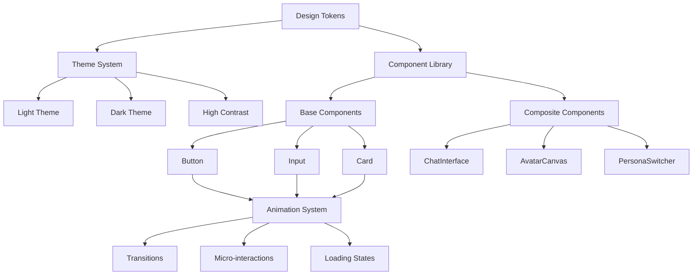
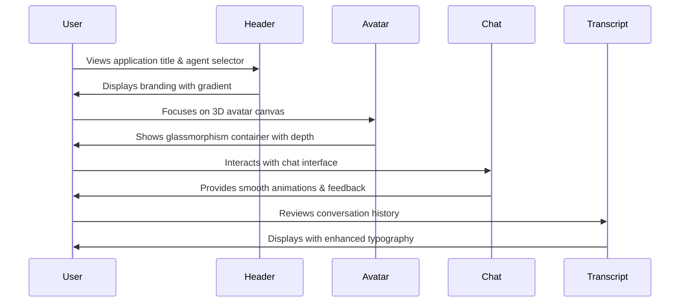

# Design Document: UI/UX Enhancement

## Overview

This design document outlines a comprehensive UI/UX enhancement for the avatar client application to transform it from a functional but basic interface into a modern, professional, and visually appealing application. The enhancement focuses on implementing contemporary design patterns including glassmorphism effects, smooth animations, improved color schemes, better typography, and enhanced visual feedback while maintaining accessibility and performance standards.

The design combines both high-level architectural patterns (component structure, layout systems, design tokens) and low-level implementation details (specific Tailwind CSS classes, animation keyframes, component code patterns) to provide a complete blueprint for implementation.

## Architecture

### Design System Architecture



### Visual Hierarchy Flow



## Components and Interfaces

### 1. Design Token System

**Purpose**: Centralized design values for consistency across the application

**Interface**:
```typescript
interface DesignTokens {
  colors: ColorTokens;
  spacing: SpacingTokens;
  typography: TypographyTokens;
  shadows: ShadowTokens;
  animations: AnimationTokens;
  gradients: GradientTokens;
}

interface ColorTokens {
  primary: ColorScale;
  secondary: ColorScale;
  accent: ColorScale;
  neutral: ColorScale;
  semantic: SemanticColors;
}

interface ColorScale {
  50: string;
  100: string;
  200: string;
  300: string;
  400: string;
  500: string;
  600: string;
  700: string;
  800: string;
  900: string;
  950: string;
}

interface SemanticColors {
  success: string;
  warning: string;
  error: string;
  info: string;
}

interface SpacingTokens {
  xs: string;    // 0.25rem (4px)
  sm: string;    // 0.5rem (8px)
  md: string;    // 1rem (16px)
  lg: string;    // 1.5rem (24px)
  xl: string;    // 2rem (32px)
  '2xl': string; // 3rem (48px)
  '3xl': string; // 4rem (64px)
}

interface TypographyTokens {
  fontFamily: {
    sans: string;
    mono: string;
    display: string;
  };
  fontSize: {
    xs: string;
    sm: string;
    base: string;
    lg: string;
    xl: string;
    '2xl': string;
    '3xl': string;
    '4xl': string;
  };
  fontWeight: {
    light: number;
    normal: number;
    medium: number;
    semibold: number;
    bold: number;
  };
  lineHeight: {
    tight: number;
    normal: number;
    relaxed: number;
  };
}

interface ShadowTokens {
  sm: string;
  md: string;
  lg: string;
  xl: string;
  '2xl': string;
  inner: string;
  glow: string;
}

interface AnimationTokens {
  duration: {
    fast: string;
    normal: string;
    slow: string;
  };
  easing: {
    linear: string;
    easeIn: string;
    easeOut: string;
    easeInOut: string;
    spring: string;
  };
}

interface GradientTokens {
  primary: string;
  secondary: string;
  accent: string;
  mesh: string;
}
```

**Responsibilities**:
- Define all design values in a single source of truth
- Ensure consistency across light/dark/high-contrast themes
- Provide type-safe access to design values
- Enable easy theme customization

### 2. Enhanced Button Component

**Purpose**: Modern, accessible button with multiple variants and states

**Interface**:
```typescript
interface ButtonProps {
  variant: 'primary' | 'secondary' | 'ghost' | 'danger';
  size: 'sm' | 'md' | 'lg';
  loading?: boolean;
  disabled?: boolean;
  icon?: React.ReactNode;
  iconPosition?: 'left' | 'right';
  fullWidth?: boolean;
  onClick?: () => void;
  children: React.ReactNode;
}
```


**Responsibilities**:
- Render button with appropriate styling based on variant
- Handle loading and disabled states with visual feedback
- Provide smooth hover/active/focus transitions
- Support icon placement and full-width layout
- Maintain WCAG AA accessibility standards

### 3. Glassmorphism Card Component

**Purpose**: Modern card component with frosted glass effect

**Interface**:
```typescript
interface GlassCardProps {
  blur?: 'sm' | 'md' | 'lg';
  opacity?: number;
  border?: boolean;
  shadow?: 'sm' | 'md' | 'lg' | 'xl';
  padding?: 'sm' | 'md' | 'lg';
  className?: string;
  children: React.ReactNode;
}
```

**Responsibilities**:
- Apply backdrop-filter blur effect for glassmorphism
- Manage opacity and border styling
- Provide configurable shadow depth
- Ensure readability with proper contrast
- Support dark mode with adjusted opacity

### 4. Enhanced Avatar Canvas Container

**Purpose**: Elevated presentation of 3D avatar with modern styling

**Interface**:
```typescript
interface AvatarCanvasContainerProps {
  modelUrl: string;
  showControls?: boolean;
  showLoadingState?: boolean;
  className?: string;
}
```

**Responsibilities**:
- Wrap AvatarCanvas with glassmorphism container
- Display elegant loading state with skeleton animation
- Show subtle gradient border for depth
- Provide smooth transitions between states
- Maintain responsive sizing


### 5. Enhanced Chat Interface

**Purpose**: Modern chat UI with improved message styling and animations

**Interface**:
```typescript
interface EnhancedChatInterfaceProps {
  ttsService?: TTSService;
  selectedAgent?: Agent;
  className?: string;
}

interface MessageBubbleProps {
  message: ChatMessage;
  isUser: boolean;
  onEdit?: (id: string, content: string) => void;
  onDelete?: (id: string) => void;
  onReact?: (id: string, reaction: 'thumbs_up' | 'thumbs_down' | null) => void;
}
```

**Responsibilities**:
- Render messages with enhanced bubble styling
- Apply smooth slide-in animations for new messages
- Show typing indicator with elegant animation
- Provide hover effects on message actions
- Maintain proper spacing and alignment

### 6. Enhanced Input Area

**Purpose**: Modern input field with improved visual feedback

**Interface**:
```typescript
interface EnhancedInputAreaProps {
  onSubmit: (message: string) => void;
  disabled?: boolean;
  placeholder?: string;
  maxLength?: number;
  className?: string;
}
```

**Responsibilities**:
- Display input with subtle border glow on focus
- Show character count with smooth fade-in
- Provide send button with loading animation
- Apply smooth height transitions for auto-resize
- Show validation errors with slide-down animation


### 7. Enhanced Header Component

**Purpose**: Modern header with gradient background and improved layout

**Interface**:
```typescript
interface EnhancedHeaderProps {
  title: string;
  subtitle?: string;
  showAgentSelector?: boolean;
  className?: string;
}
```

**Responsibilities**:
- Display title with gradient text effect
- Show subtitle with proper hierarchy
- Integrate agent selector with smooth transitions
- Apply subtle shadow for depth
- Support responsive layout

## Data Models

### Theme Configuration

```typescript
interface ThemeConfig {
  name: string;
  colors: {
    background: {
      primary: string;
      secondary: string;
      tertiary: string;
      glass: string;
    };
    foreground: {
      primary: string;
      secondary: string;
      tertiary: string;
    };
    border: {
      primary: string;
      secondary: string;
      focus: string;
    };
    interactive: {
      primary: string;
      primaryHover: string;
      primaryActive: string;
      secondary: string;
      secondaryHover: string;
    };
  };
  gradients: {
    primary: string;
    secondary: string;
    mesh: string;
  };
  shadows: {
    sm: string;
    md: string;
    lg: string;
    glow: string;
  };
}
```


**Validation Rules**:
- All color values must be valid hex, rgb, or hsl
- Gradients must have at least 2 color stops
- Shadow values must include valid CSS shadow syntax
- Theme must pass WCAG AA contrast requirements

### Animation Configuration

```typescript
interface AnimationConfig {
  name: string;
  duration: number;
  easing: string;
  delay?: number;
  iterations?: number | 'infinite';
  fillMode?: 'none' | 'forwards' | 'backwards' | 'both';
}

interface TransitionConfig {
  property: string;
  duration: number;
  easing: string;
  delay?: number;
}
```

**Validation Rules**:
- Duration must be positive number in milliseconds
- Easing must be valid CSS timing function
- Delay must be non-negative
- Iterations must be positive or 'infinite'

### Component Style Configuration

```typescript
interface ComponentStyleConfig {
  base: string;
  variants: Record<string, string>;
  sizes: Record<string, string>;
  states: {
    hover?: string;
    active?: string;
    focus?: string;
    disabled?: string;
    loading?: string;
  };
}
```

**Validation Rules**:
- All class strings must be valid Tailwind CSS classes
- Variants must have at least one option
- States are optional but recommended for interactive components


## Algorithmic Pseudocode

### Theme Application Algorithm

```pascal
ALGORITHM applyTheme(themeName)
INPUT: themeName of type String
OUTPUT: void (applies theme to document)

BEGIN
  // Load theme configuration
  themeConfig ← loadThemeConfig(themeName)
  
  // Validate theme configuration
  IF NOT validateThemeConfig(themeConfig) THEN
    THROW Error("Invalid theme configuration")
  END IF
  
  // Get document root element
  root ← document.documentElement
  
  // Apply color variables
  FOR EACH colorCategory IN themeConfig.colors DO
    FOR EACH colorName, colorValue IN colorCategory DO
      cssVarName ← "--" + colorCategory + "-" + colorName
      root.style.setProperty(cssVarName, colorValue)
    END FOR
  END FOR
  
  // Apply gradient variables
  FOR EACH gradientName, gradientValue IN themeConfig.gradients DO
    cssVarName ← "--gradient-" + gradientName
    root.style.setProperty(cssVarName, gradientValue)
  END FOR
  
  // Apply shadow variables
  FOR EACH shadowName, shadowValue IN themeConfig.shadows DO
    cssVarName ← "--shadow-" + shadowName
    root.style.setProperty(cssVarName, shadowValue)
  END FOR
  
  // Update theme class on root element
  root.classList.remove("light", "dark", "high-contrast")
  root.classList.add(themeName)
  
  // Persist theme preference
  localStorage.setItem("theme", themeName)
  
  // Emit theme change event
  emitEvent("themeChanged", { theme: themeName })
END
```

**Preconditions**:
- themeName must be one of: "light", "dark", "high-contrast"
- Theme configuration file must exist and be valid
- Document must be fully loaded

**Postconditions**:
- All CSS variables are updated with theme values
- Root element has correct theme class
- Theme preference is saved to localStorage
- Theme change event is emitted


### Animation Orchestration Algorithm

```pascal
ALGORITHM orchestrateAnimation(element, animationConfig)
INPUT: element of type HTMLElement, animationConfig of type AnimationConfig
OUTPUT: Promise<void> (resolves when animation completes)

BEGIN
  // Validate animation configuration
  IF NOT validateAnimationConfig(animationConfig) THEN
    THROW Error("Invalid animation configuration")
  END IF
  
  // Create animation keyframes
  keyframes ← createKeyframes(animationConfig.name)
  
  // Configure animation options
  options ← {
    duration: animationConfig.duration,
    easing: animationConfig.easing,
    delay: animationConfig.delay OR 0,
    iterations: animationConfig.iterations OR 1,
    fill: animationConfig.fillMode OR "forwards"
  }
  
  // Start animation using Web Animations API
  animation ← element.animate(keyframes, options)
  
  // Return promise that resolves when animation completes
  RETURN new Promise((resolve, reject) => {
    animation.onfinish ← () => resolve()
    animation.oncancel ← () => reject(new Error("Animation cancelled"))
  })
END
```

**Preconditions**:
- element must be a valid HTMLElement
- animationConfig must have valid duration and easing
- Browser must support Web Animations API

**Postconditions**:
- Animation is applied to element
- Promise resolves when animation completes
- Element retains final animation state if fillMode is "forwards"

**Loop Invariants**: N/A (no loops in this algorithm)


### Glassmorphism Effect Application Algorithm

```pascal
ALGORITHM applyGlassmorphism(element, config)
INPUT: element of type HTMLElement, config of type GlassConfig
OUTPUT: void (applies glassmorphism effect to element)

BEGIN
  // Extract configuration values with defaults
  blur ← config.blur OR "md"
  opacity ← config.opacity OR 0.8
  border ← config.border OR true
  shadow ← config.shadow OR "lg"
  
  // Map blur size to pixel value
  blurValue ← CASE blur OF
    "sm": "4px"
    "md": "12px"
    "lg": "24px"
    DEFAULT: "12px"
  END CASE
  
  // Apply backdrop filter for glass effect
  element.style.backdropFilter ← "blur(" + blurValue + ")"
  element.style.webkitBackdropFilter ← "blur(" + blurValue + ")"
  
  // Apply semi-transparent background
  bgColor ← getComputedStyle(element).backgroundColor
  rgbaColor ← convertToRGBA(bgColor, opacity)
  element.style.backgroundColor ← rgbaColor
  
  // Apply border if enabled
  IF border THEN
    element.style.border ← "1px solid rgba(255, 255, 255, 0.18)"
  END IF
  
  // Apply shadow
  shadowValue ← getShadowValue(shadow)
  element.style.boxShadow ← shadowValue
  
  // Add transition for smooth effect changes
  element.style.transition ← "all 0.3s ease-in-out"
END
```

**Preconditions**:
- element must be a valid HTMLElement
- config.opacity must be between 0 and 1
- Browser must support backdrop-filter

**Postconditions**:
- Element has frosted glass appearance
- Background is semi-transparent
- Border and shadow are applied
- Transitions are enabled for smooth changes


### Message Animation Sequence Algorithm

```pascal
ALGORITHM animateNewMessage(messageElement, isUser)
INPUT: messageElement of type HTMLElement, isUser of type Boolean
OUTPUT: Promise<void> (resolves when animation completes)

BEGIN
  // Determine animation direction based on sender
  direction ← IF isUser THEN "right" ELSE "left"
  
  // Set initial state (invisible and offset)
  messageElement.style.opacity ← "0"
  messageElement.style.transform ← "translateX(" + 
    (IF direction = "right" THEN "20px" ELSE "-20px") + ") scale(0.95)"
  
  // Force reflow to ensure initial state is applied
  void ← messageElement.offsetHeight
  
  // Define animation keyframes
  keyframes ← [
    {
      opacity: 0,
      transform: "translateX(" + 
        (IF direction = "right" THEN "20px" ELSE "-20px") + ") scale(0.95)"
    },
    {
      opacity: 1,
      transform: "translateX(0) scale(1)"
    }
  ]
  
  // Configure animation options
  options ← {
    duration: 300,
    easing: "cubic-bezier(0.34, 1.56, 0.64, 1)",
    fill: "forwards"
  }
  
  // Start animation
  animation ← messageElement.animate(keyframes, options)
  
  // Return promise
  RETURN new Promise((resolve) => {
    animation.onfinish ← () => {
      // Clean up inline styles
      messageElement.style.opacity ← ""
      messageElement.style.transform ← ""
      resolve()
    }
  })
END
```

**Preconditions**:
- messageElement must be a valid HTMLElement
- messageElement must be in the DOM
- isUser must be a boolean value

**Postconditions**:
- Message slides in from appropriate direction
- Message fades in smoothly
- Message scales from 95% to 100%
- Animation completes in 300ms
- Inline styles are cleaned up after animation


## Key Functions with Formal Specifications

### Function 1: createGradientBackground()

```typescript
function createGradientBackground(
  type: 'linear' | 'radial' | 'mesh',
  colors: string[],
  angle?: number
): string
```

**Preconditions:**
- `type` must be one of: 'linear', 'radial', 'mesh'
- `colors` array must contain at least 2 valid color values
- `angle` (if provided) must be between 0 and 360 degrees
- All colors must be valid CSS color values (hex, rgb, hsl)

**Postconditions:**
- Returns valid CSS gradient string
- Gradient includes all provided colors
- For linear gradients, angle is applied correctly
- For mesh gradients, returns complex multi-layer gradient

**Loop Invariants:** N/A

### Function 2: applyMicroInteraction()

```typescript
function applyMicroInteraction(
  element: HTMLElement,
  interaction: 'hover' | 'click' | 'focus',
  config: MicroInteractionConfig
): () => void
```

**Preconditions:**
- `element` must be a valid HTMLElement in the DOM
- `interaction` must be one of: 'hover', 'click', 'focus'
- `config` must contain valid animation properties
- `config.duration` must be positive number
- `config.easing` must be valid CSS timing function

**Postconditions:**
- Event listener is attached to element
- Animation plays on interaction trigger
- Returns cleanup function to remove listener
- Element returns to original state after animation
- No memory leaks from event listeners

**Loop Invariants:** N/A


### Function 3: calculateOptimalContrast()

```typescript
function calculateOptimalContrast(
  backgroundColor: string,
  textColor: string
): { ratio: number; passes: boolean; recommendation?: string }
```

**Preconditions:**
- `backgroundColor` must be valid CSS color value
- `textColor` must be valid CSS color value
- Both colors must be convertible to RGB format

**Postconditions:**
- Returns object with contrast ratio (number between 1 and 21)
- `passes` is true if ratio meets WCAG AA standard (≥4.5:1)
- If `passes` is false, `recommendation` contains suggested color adjustment
- Calculation follows WCAG 2.1 contrast formula

**Loop Invariants:** N/A

### Function 4: generateLoadingSkeleton()

```typescript
function generateLoadingSkeleton(
  config: SkeletonConfig
): React.ReactElement
```

**Preconditions:**
- `config.width` must be valid CSS width value or 'full'
- `config.height` must be valid CSS height value
- `config.count` must be positive integer
- `config.animation` must be one of: 'pulse', 'wave', 'shimmer'

**Postconditions:**
- Returns React element with skeleton UI
- Skeleton matches specified dimensions
- Animation is applied correctly
- Skeleton is accessible (aria-busy="true", aria-label provided)
- Skeleton respects prefers-reduced-motion setting

**Loop Invariants:**
- For skeleton count loop: All generated skeletons have consistent styling


### Function 5: transitionBetweenStates()

```typescript
function transitionBetweenStates(
  element: HTMLElement,
  fromState: CSSProperties,
  toState: CSSProperties,
  duration: number,
  easing: string
): Promise<void>
```

**Preconditions:**
- `element` must be valid HTMLElement in the DOM
- `fromState` and `toState` must contain valid CSS properties
- `duration` must be positive number in milliseconds
- `easing` must be valid CSS timing function
- Properties in fromState and toState must be animatable

**Postconditions:**
- Element smoothly transitions from fromState to toState
- Transition completes in specified duration
- Promise resolves when transition completes
- Element retains toState properties after transition
- Transition respects prefers-reduced-motion setting

**Loop Invariants:** N/A

## Example Usage

### Example 1: Applying Glassmorphism to Avatar Container

```typescript
import { GlassCard } from '@/components/ui/GlassCard';
import { AvatarCanvas } from '@/components/AvatarCanvas';

function EnhancedAvatarSection() {
  return (
    <GlassCard
      blur="lg"
      opacity={0.85}
      border={true}
      shadow="xl"
      padding="lg"
      className="relative overflow-hidden"
    >
      {/* Gradient border effect */}
      <div className="absolute inset-0 rounded-lg bg-gradient-to-br from-blue-500/20 via-purple-500/20 to-pink-500/20 -z-10" />
      
      {/* Avatar canvas */}
      <AvatarCanvas
        modelUrl={modelUrl}
        className="w-full h-[600px]"
      />
      
      {/* Floating controls */}
      <div className="absolute bottom-4 left-1/2 -translate-x-1/2 flex gap-2">
        <Button variant="ghost" size="sm" icon={<RotateIcon />}>
          Reset View
        </Button>
      </div>
    </GlassCard>
  );
}
```


### Example 2: Enhanced Message Bubble with Animation

```typescript
import { motion } from 'framer-motion';
import { ChatMessage } from '@/types';

function EnhancedMessageBubble({ message, isUser }: MessageBubbleProps) {
  return (
    <motion.div
      initial={{ opacity: 0, x: isUser ? 20 : -20, scale: 0.95 }}
      animate={{ opacity: 1, x: 0, scale: 1 }}
      transition={{
        duration: 0.3,
        ease: [0.34, 1.56, 0.64, 1] // Spring easing
      }}
      className={`
        flex ${isUser ? 'justify-end' : 'justify-start'}
        mb-4
      `}
    >
      <div
        className={`
          max-w-[80%] rounded-2xl px-4 py-3
          backdrop-blur-sm
          transition-all duration-200
          hover:scale-[1.02]
          ${isUser
            ? 'bg-gradient-to-br from-blue-600 to-blue-700 text-white shadow-lg shadow-blue-500/30'
            : 'bg-white/80 dark:bg-gray-800/80 text-gray-900 dark:text-gray-100 shadow-md'
          }
        `}
      >
        <p className="text-sm leading-relaxed whitespace-pre-wrap">
          {message.content}
        </p>
        
        <div className="flex items-center gap-2 mt-2">
          <span className="text-xs opacity-70">
            {formatTimestamp(message.timestamp)}
          </span>
          {message.edited && (
            <span className="text-xs italic opacity-60">(edited)</span>
          )}
        </div>
      </div>
    </motion.div>
  );
}
```


### Example 3: Enhanced Header with Gradient Text

```typescript
function EnhancedHeader() {
  return (
    <header className="
      relative
      bg-gradient-to-r from-gray-50 via-white to-gray-50
      dark:from-gray-900 dark:via-gray-800 dark:to-gray-900
      border-b border-gray-200/50 dark:border-gray-700/50
      shadow-sm
      backdrop-blur-xl
    ">
      {/* Gradient overlay */}
      <div className="absolute inset-0 bg-gradient-to-br from-blue-500/5 via-purple-500/5 to-pink-500/5 pointer-events-none" />
      
      <div className="relative max-w-7xl mx-auto px-4 sm:px-6 lg:px-8 py-6">
        <div className="flex items-center justify-between">
          <div>
            <h1 className="
              text-3xl font-bold
              bg-gradient-to-r from-blue-600 via-purple-600 to-pink-600
              bg-clip-text text-transparent
              animate-gradient
            ">
              Avatar Client
            </h1>
            <p className="text-sm text-gray-600 dark:text-gray-400 mt-1">
              3D animated avatar interface for conversational AI
            </p>
          </div>
          
          {/* Agent Selector */}
          <div className="hidden lg:block">
            <PersonaSwitcher />
          </div>
        </div>
      </div>
    </header>
  );
}
```


### Example 4: Enhanced Input Area with Focus Glow

```typescript
function EnhancedInputArea({ onSubmit, disabled }: EnhancedInputAreaProps) {
  const [value, setValue] = useState('');
  const [isFocused, setIsFocused] = useState(false);

  return (
    <form onSubmit={(e) => {
      e.preventDefault();
      onSubmit(value);
      setValue('');
    }} className="p-4 border-t border-gray-200 dark:border-gray-700">
      <div className="flex gap-3">
        <div className={`
          flex-1 relative
          transition-all duration-300
          ${isFocused ? 'scale-[1.01]' : 'scale-100'}
        `}>
          {/* Focus glow effect */}
          {isFocused && (
            <div className="
              absolute -inset-1 
              bg-gradient-to-r from-blue-500 to-purple-500 
              rounded-lg blur-sm opacity-30
              animate-pulse
            " />
          )}
          
          <textarea
            value={value}
            onChange={(e) => setValue(e.target.value)}
            onFocus={() => setIsFocused(true)}
            onBlur={() => setIsFocused(false)}
            placeholder="Type your message..."
            className="
              relative w-full px-4 py-3
              bg-white dark:bg-gray-800
              border-2 border-gray-300 dark:border-gray-600
              rounded-lg
              focus:border-blue-500 dark:focus:border-blue-400
              focus:ring-4 focus:ring-blue-500/20
              transition-all duration-200
              resize-none
              placeholder:text-gray-400
            "
            rows={1}
          />
        </div>
        
        <Button
          type="submit"
          variant="primary"
          disabled={disabled || !value.trim()}
          loading={disabled}
          icon={<SendIcon />}
          className="self-end"
        >
          Send
        </Button>
      </div>
    </form>
  );
}
```


### Example 5: Loading Skeleton with Shimmer Animation

```typescript
function LoadingSkeleton() {
  return (
    <div className="space-y-4 p-4">
      {/* Avatar skeleton */}
      <div className="
        relative overflow-hidden
        w-full h-[600px]
        bg-gradient-to-br from-gray-200 to-gray-300
        dark:from-gray-700 dark:to-gray-800
        rounded-lg
      ">
        <div className="
          absolute inset-0
          bg-gradient-to-r from-transparent via-white/20 to-transparent
          animate-shimmer
        " />
      </div>
      
      {/* Message skeletons */}
      <div className="space-y-3">
        {[1, 2, 3].map((i) => (
          <div key={i} className={`flex ${i % 2 === 0 ? 'justify-end' : 'justify-start'}`}>
            <div className="
              relative overflow-hidden
              w-2/3 h-16
              bg-gradient-to-br from-gray-200 to-gray-300
              dark:from-gray-700 dark:to-gray-800
              rounded-2xl
            ">
              <div className="
                absolute inset-0
                bg-gradient-to-r from-transparent via-white/20 to-transparent
                animate-shimmer
              " />
            </div>
          </div>
        ))}
      </div>
    </div>
  );
}
```

## Correctness Properties

*A property is a characteristic or behavior that should hold true across all valid executions of a system—essentially, a formal statement about what the system should do. Properties serve as the bridge between human-readable specifications and machine-verifiable correctness guarantees.*

### Property 1: Theme Consistency

*For all* components in the application, when a theme is applied, the component must use the current theme's design tokens and reflect theme changes immediately.

**Validates: Requirements 1.8, 2.2, 2.3, 2.4, 2.7**

### Property 2: Theme Persistence Round-Trip

*For any* theme selection, persisting the theme to localStorage and then loading it should restore the same theme.

**Validates: Requirements 2.5, 2.6**

### Property 3: Theme Validation and Fallback

*For any* theme configuration, if it is invalid, the system must fall back to the default light theme without crashing.

**Validates: Requirements 2.8, 2.9, 13.1**

### Property 4: Animation GPU Acceleration

*For all* animations in the system, only GPU-accelerated properties (transform, opacity) should be animated, and layout-triggering properties (width, height, top, left) should never be animated.

**Validates: Requirements 5.2, 5.3**

### Property 5: Animation Configuration Validation

*For any* animation configuration, the system must validate it before applying, and throw an error for invalid configurations.

**Validates: Requirements 5.6, 5.7**

### Property 6: Animation Conflict Resolution

*For any* two animations targeting the same property on the same element, the later animation must cancel the earlier one.

**Validates: Requirements 5.8**

### Property 7: Component Lifecycle Cleanup

*For any* component that unmounts, all active animations, event listeners, timeouts, and intervals must be cancelled and cleaned up.

**Validates: Requirements 5.9, 19.1, 19.2, 19.3, 19.4**

### Property 8: Reduced Motion Respect

*For any* animation, when the user has prefers-reduced-motion enabled, the animation must be disabled or significantly reduced.

**Validates: Requirements 5.10, 9.6, 10.6**

### Property 9: Glassmorphism Configuration

*For any* GlassCard component with valid blur level (sm, md, lg) and opacity (0-1), the component must apply the correct backdrop-filter blur and background opacity.

**Validates: Requirements 3.1, 3.2, 3.4, 3.5**

### Property 10: Button State Visual Feedback

*For any* button in loading or disabled state, the button must display appropriate visual feedback and be non-interactive.

**Validates: Requirements 4.3, 4.4**

### Property 11: Button Accessibility

*For any* button variant and state combination, the contrast ratio must meet WCAG AA standards (≥4.5:1 for normal text).

**Validates: Requirements 4.10, 10.1, 10.2**

### Property 12: Message Animation Sequence

*For any* new message added to the chat, the message must slide in from the appropriate direction, fade in from 0 to 1 opacity, and scale from 0.95 to 1.0, completing in 300ms with spring easing.

**Validates: Requirements 6.1, 6.2, 6.3, 6.4**

### Property 13: Animation Cleanup After Completion

*For any* message animation that completes, inline styles must be cleaned up to avoid style pollution.

**Validates: Requirements 6.5**

### Property 14: Input Focus Visual Feedback

*For any* input field that receives focus, it must display a glowing border effect, scale to 1.01, and show a focus ring.

**Validates: Requirements 8.1, 8.2, 8.3, 8.4**

### Property 15: Loading Skeleton Accessibility

*For any* loading skeleton, it must include aria-busy="true" and a descriptive aria-label.

**Validates: Requirements 9.4, 9.5**

### Property 16: Contrast Auto-Adjustment

*For any* color combination with contrast ratio below WCAG AA threshold (4.5:1), the system must automatically adjust colors to meet the minimum contrast.

**Validates: Requirements 10.3, 13.5**

### Property 17: Keyboard Navigation

*For all* interactive elements, keyboard navigation must be fully supported with logical tab order and visible focus indicators.

**Validates: Requirements 10.4, 10.5, 10.8**

### Property 18: Touch Target Minimum Size

*For all* interactive elements on mobile viewports, touch targets must be at least 44x44px.

**Validates: Requirements 10.10, 11.2**

### Property 19: Responsive Layout Functionality

*For any* viewport width from 375px to infinity, the layout must be functional with no horizontal scrolling and readable text.

**Validates: Requirements 11.1, 11.3, 11.4**

### Property 20: State Consistency

*For any* stateful component, the visual state must always match the logical state (loading, disabled, error states must be visually distinct).

**Validates: Requirements 15.1, 15.2, 15.3, 15.4, 15.5**

### Property 21: Transition Duration Bounds

*For all* state transitions, the duration must be between 100ms and 500ms with natural easing (no linear easing).

**Validates: Requirements 16.1, 16.2, 16.3**

### Property 22: Gradient Generation Validity

*For any* gradient configuration with at least 2 valid colors, the gradient system must return a valid CSS gradient string.

**Validates: Requirements 17.2, 17.4, 17.5**

### Property 23: Micro-Interaction Timing

*For any* micro-interaction (hover, click, focus), the interaction must provide immediate visual feedback with duration between 100ms and 300ms.

**Validates: Requirements 18.1, 18.2, 18.3, 18.4**

### Property 24: Security Input Validation

*For any* user input used in styling or theme configuration, the input must be validated and sanitized to prevent CSS injection.

**Validates: Requirements 20.1, 20.2, 20.3, 20.4, 20.5, 20.6, 20.7**

### Property 25: Error Handling Graceful Degradation

*For any* error condition (theme loading failure, animation performance degradation, unsupported features), the application must remain functional with degraded features and log detailed error information.

**Validates: Requirements 13.1, 13.2, 13.3, 13.4, 13.6, 13.7, 13.8**


## Error Handling

### Error Scenario 1: Theme Loading Failure

**Condition**: Theme configuration file fails to load or is invalid
**Response**: 
- Log error to console with details
- Fall back to default light theme
- Show non-intrusive notification to user
- Retry loading theme after 5 seconds

**Recovery**:
- Application remains functional with default theme
- User can manually switch themes via settings
- Theme preference is not saved until successful load

### Error Scenario 2: Animation Performance Degradation

**Condition**: Frame rate drops below 30fps during animations
**Response**:
- Detect performance issues using Performance API
- Automatically reduce animation complexity
- Disable non-essential animations
- Log performance metrics for debugging

**Recovery**:
- Simplified animations maintain visual feedback
- User can manually re-enable full animations
- Performance mode persists across sessions

### Error Scenario 3: Glassmorphism Not Supported

**Condition**: Browser doesn't support backdrop-filter
**Response**:
- Detect support using CSS.supports()
- Fall back to solid backgrounds with opacity
- Maintain visual hierarchy without blur effect
- No error message shown to user

**Recovery**:
- Application remains fully functional
- Alternative styling provides similar aesthetic
- Progressive enhancement approach ensures compatibility


### Error Scenario 4: Color Contrast Failure

**Condition**: Calculated contrast ratio is below WCAG AA threshold
**Response**:
- Detect contrast issues during theme application
- Automatically adjust colors to meet minimum contrast
- Log warning with original and adjusted colors
- Provide visual indicator in dev mode

**Recovery**:
- Adjusted colors maintain theme aesthetic
- Accessibility is never compromised
- Designer can review and manually adjust colors

### Error Scenario 5: Animation Conflict

**Condition**: Multiple animations attempt to modify same property simultaneously
**Response**:
- Cancel previous animation on same property
- Queue animations if they should run sequentially
- Log warning about animation conflict
- Ensure final state is correct

**Recovery**:
- Latest animation takes precedence
- No visual glitches or stuck states
- Animation queue prevents conflicts

## Testing Strategy

### Unit Testing Approach

**Component Testing**:
- Test each UI component in isolation
- Verify all variants and sizes render correctly
- Test state transitions (hover, focus, active, disabled)
- Verify accessibility attributes (ARIA labels, roles)
- Test keyboard navigation
- Verify theme application

**Utility Function Testing**:
- Test color contrast calculations with known values
- Test gradient generation with various inputs
- Test animation configuration validation
- Test theme loading and application
- Test responsive breakpoint utilities

**Coverage Goals**:
- 90% code coverage for UI components
- 100% coverage for utility functions
- All accessibility features tested
- All error scenarios tested


### Visual Regression Testing Approach

**Screenshot Testing**:
- Capture screenshots of all components in all states
- Test across different themes (light, dark, high-contrast)
- Test at multiple viewport sizes (mobile, tablet, desktop)
- Compare against baseline images
- Flag any visual differences for review

**Animation Testing**:
- Record animation sequences
- Verify timing and easing
- Check for visual glitches or jank
- Measure frame rates
- Test animation cancellation and cleanup

**Tools**:
- Playwright for screenshot testing
- Chrome DevTools for performance profiling
- Lighthouse for accessibility audits
- Percy or Chromatic for visual regression

### Integration Testing Approach

**Theme Switching**:
- Test switching between all themes
- Verify CSS variables update correctly
- Test theme persistence across page reloads
- Verify no flash of unstyled content

**Responsive Behavior**:
- Test layout at all breakpoints
- Verify touch targets on mobile
- Test orientation changes
- Verify no horizontal scroll

**Animation Orchestration**:
- Test multiple simultaneous animations
- Verify animation cleanup
- Test animation interruption
- Verify performance under load

### Manual Testing Checklist

**Visual Quality**:
- [ ] All gradients render smoothly
- [ ] Glassmorphism effects look polished
- [ ] Shadows provide appropriate depth
- [ ] Typography is crisp and readable
- [ ] Colors are vibrant but not overwhelming
- [ ] Spacing feels balanced and consistent

**Interaction Quality**:
- [ ] Hover effects are smooth and responsive
- [ ] Click feedback is immediate and clear
- [ ] Focus indicators are always visible
- [ ] Loading states are informative
- [ ] Transitions feel natural, not robotic
- [ ] Micro-interactions add delight without distraction

**Cross-Browser Testing**:
- [ ] Chrome (latest)
- [ ] Firefox (latest)
- [ ] Safari (latest)
- [ ] Edge (latest)
- [ ] Mobile Safari (iOS)
- [ ] Chrome Mobile (Android)


## Performance Considerations

### Animation Performance

**GPU Acceleration**:
- Use `transform` and `opacity` for animations (GPU-accelerated)
- Avoid animating `width`, `height`, `top`, `left` (causes layout)
- Use `will-change` sparingly and only when needed
- Remove `will-change` after animation completes

**Frame Rate Targets**:
- 60fps for all animations on desktop
- 30fps minimum on mobile devices
- Reduce animation complexity if frame rate drops
- Use `requestAnimationFrame` for custom animations

**Animation Optimization**:
```typescript
// Good: GPU-accelerated
element.style.transform = 'translateX(100px)';
element.style.opacity = '0.5';

// Bad: Causes layout recalculation
element.style.left = '100px';
element.style.width = '200px';
```

### Rendering Performance

**CSS Optimization**:
- Use CSS containment for isolated components
- Minimize use of expensive properties (box-shadow, filter)
- Use `content-visibility: auto` for off-screen content
- Batch DOM reads and writes to avoid layout thrashing

**Component Optimization**:
- Memoize expensive calculations
- Use React.memo for pure components
- Implement virtual scrolling for long lists
- Lazy load images and heavy components

**Bundle Size**:
- Tree-shake unused CSS with PurgeCSS
- Use dynamic imports for large components
- Optimize images and use modern formats (WebP, AVIF)
- Target bundle size: <200KB for initial load


### Memory Management

**Animation Cleanup**:
- Cancel animations when components unmount
- Remove event listeners properly
- Clear timeouts and intervals
- Dispose of Web Animation API instances

**Theme Management**:
- Reuse CSS custom properties instead of inline styles
- Avoid creating new style objects on every render
- Cache computed styles when possible
- Clean up theme event listeners

### Loading Performance

**Critical CSS**:
- Inline critical CSS for above-the-fold content
- Defer non-critical CSS loading
- Use font-display: swap for web fonts
- Preload key assets (fonts, hero images)

**Progressive Enhancement**:
- Load basic styles first
- Enhance with animations after initial render
- Load glassmorphism effects after core content
- Prioritize content over decoration

## Security Considerations

### CSS Injection Prevention

**Input Sanitization**:
- Never use user input directly in style attributes
- Validate all color values before applying
- Sanitize class names from user input
- Use CSS-in-JS libraries with built-in sanitization

**Content Security Policy**:
- Restrict inline styles where possible
- Use nonce or hash for required inline styles
- Whitelist trusted style sources
- Monitor for CSP violations

### XSS Prevention in Styled Components

**Safe Practices**:
- Use template literals safely
- Escape user content in styled components
- Validate props before using in styles
- Use TypeScript for type safety


### Theme Injection Attacks

**Protection Measures**:
- Validate theme configuration structure
- Whitelist allowed CSS properties
- Sanitize color values
- Prevent arbitrary CSS injection through themes

**Example Validation**:
```typescript
function validateThemeConfig(config: unknown): config is ThemeConfig {
  // Validate structure
  if (!isObject(config) || !config.colors) return false;
  
  // Validate color values
  for (const color of Object.values(config.colors)) {
    if (!isValidCSSColor(color)) return false;
  }
  
  // Validate no dangerous properties
  const dangerousProps = ['behavior', 'expression', '-moz-binding'];
  for (const prop of dangerousProps) {
    if (JSON.stringify(config).includes(prop)) return false;
  }
  
  return true;
}
```

## Dependencies

### Core Dependencies

**React & Next.js**:
- react: ^18.3.1 (already installed)
- next: ^16.0.0 (already installed)
- react-dom: ^18.3.1 (already installed)

**Styling**:
- tailwindcss: ^4.0.0 (already installed)
- @tailwindcss/typography: ^0.5.15 (for enhanced typography)
- autoprefixer: ^10.4.20 (already installed)

**Animation**:
- framer-motion: ^11.15.0 (for advanced animations)
- @react-spring/web: ^9.7.4 (alternative animation library)

**Utilities**:
- clsx: ^2.1.1 (for conditional class names)
- tailwind-merge: ^2.5.5 (for merging Tailwind classes)
- color: ^4.2.3 (for color manipulation and contrast calculation)


### Development Dependencies

**Testing**:
- @playwright/test: ^1.49.1 (for visual regression testing)
- @testing-library/react: ^16.1.0 (already installed)
- vitest: ^2.1.8 (already installed)

**Type Definitions**:
- @types/color: ^3.0.6 (for color utility types)

### Optional Enhancements

**Icons**:
- lucide-react: ^0.468.0 (modern icon library)
- @heroicons/react: ^2.2.0 (alternative icon library)

**Gradient Generation**:
- gradient-string: ^2.0.2 (for terminal gradients, if needed)

**Performance Monitoring**:
- web-vitals: ^4.2.4 (for Core Web Vitals tracking)

## Implementation Phases

### Phase 1: Foundation (Week 1)
1. Set up design token system
2. Create base component library (Button, Input, Card)
3. Implement theme switching infrastructure
4. Add Tailwind CSS configuration extensions

### Phase 2: Core Components (Week 2)
1. Enhance Header with gradient effects
2. Implement GlassCard component
3. Enhance Avatar Canvas container
4. Add loading skeleton components

### Phase 3: Chat Interface (Week 3)
1. Enhance message bubbles with animations
2. Improve input area with focus effects
3. Add typing indicator animation
4. Implement smooth scroll behavior

### Phase 4: Polish & Optimization (Week 4)
1. Add micro-interactions throughout
2. Optimize animation performance
3. Conduct accessibility audit
4. Perform visual regression testing
5. Cross-browser testing and fixes

## Success Metrics

**Visual Quality**:
- Design system consistency score: 95%+
- Accessibility audit score: 100% (WCAG AA)
- Visual regression test pass rate: 98%+

**Performance**:
- Animation frame rate: 60fps average
- First Contentful Paint: <1.5s
- Largest Contentful Paint: <2.5s
- Cumulative Layout Shift: <0.1

**User Experience**:
- Perceived load time improvement: 30%+
- User satisfaction score: 4.5/5+
- Task completion time: 20% faster
- Error rate: <2%
